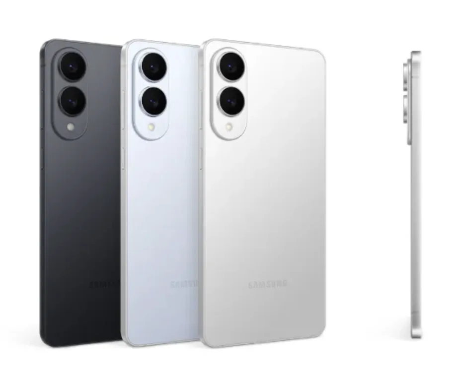

---
categories:
- 스마트폰
- 구매가이드
- 삼성갤럭시
date: 2026-01-11T22:08:48
description: 갤럭시 S25+(플러스)가 단종되어 구매가 어렵습니다. 중간 크기(6.7인치) 스마트폰을 원한다면 S25 FE와 S25 엣지
  중 무엇을 선택해야 할까요? 두 모델의 장단점을 비교해 최적의 선택을 도와드립니다.
draft: false
slug: gaelreoksi-s25-peulreoseu-danjong
tags:
- 갤럭시S25플러스
- 갤럭시S25FE
- 갤럭시S25엣지
- S25플러스대안
- 중간크기스마트폰
- 갤럭시S25비교
- 스마트폰구매가이드
- 삼성스마트폰
title: 갤럭시 S25 플러스 단종! 중간 크기 원하면 뭘 사야 할까? S25 FE vs S25 엣지 비교
---
"S25 플러스 사려고 했는데 없다고요?" 이런 상황을 겪고 계신 분들이 많으실 거예요. 앞선 포스팅에서 말씀드린 것처럼 갤럭시 S25 플러스는 2025년 중반 이후 사실상 단종 상태입니다. 삼성 공식 홈페이지에서도 라인업에서 빠져 있고, 매장에서도 구하기 어려운 상황이에요.

그래서 오늘은 S25 플러스의 대안을 찾는 분들을 위해, 같은 6.7인치 화면을 가진 **S25 FE**와 **S25 엣지**를 철저하게 비교해 드리겠습니다.

## 갤럭시 S25 FE VS 겔럭시 S25 엣지 - 핵심 스펙 비교표

겔럭시 S25 FE

먼저 두 모델의 핵심 사양을 표로 한눈에 비교해 볼게요.

| 항목         | 갤럭시 S25 FE                | 갤럭시 S25 엣지                    |
| ---------- | ------------------------- | ----------------------------- |
| 디스플레이      | 6.7인치 FHD+ (2340×1080)    | 6.7인치 QHD+ (3120×1440)        |
| 크기(mm)     | 161.3 × 76.6 × 7.4        | 158.2 × 75.6 × 5.8            |
| 무게         | 190g                      | 163g                          |
| 프로세서       | Exynos 2400               | Snapdragon 8 Elite for Galaxy |
| RAM        | 8GB                       | 12GB                          |
| 저장공간       | 256GB                     | 256GB / 512GB                 |
| 후면 카메라     | 50MP + 12MP + 8MP (3배 망원) | 200MP + 12MP (망원 없음)          |
| 전면 카메라     | 12MP                      | 12MP                          |
| 배터리        | 4,900mAh                  | 3,900mAh                      |
| 유선 충전      | 25W                       | 25W                           |
| 출고가(256GB) | 946,000원                  | 1,496,000원                    |
| 구매 가능 여부   | 정상 판매                     | 재고 한정                         |

숫자만 봐서는 잘 모르시겠죠? 하나씩 자세히 풀어서 설명해 드릴게요.

## 디자인과 휴대성

겔럭시 S25 엣지

외관에서 가장 큰 차이는 **두께와 무게**입니다.

S25 엣지는 이름처럼 "엣지"가 있는, 5.8mm의 초슬림 디자인이에요. 이 두께는 현존하는 플래그십 스마트폰 중 가장 얇은 수준입니다. 무게도 163g으로 가벼워서 손에 쥐었을 때 확연히 다른 느낌이 들어요.

반면 S25 FE는 7.4mm 두께에 190g으로, 일반적인 스마트폰과 비슷한 수준입니다. "FE 시리즈 사상 가장 얇고 가볍다"고 삼성이 홍보하고 있지만, 엣지와 비교하면 확실히 두껍고 무거워요.

얇고 가벼운 스마트폰을 원한다면 S25 엣지, 그립감과 안정감을 선호한다면 S25 FE가 더 맞습니다.

## 디스플레이 품질

화면 크기는 둘 다 6.7인치로 동일하지만, **해상도**에서 차이가 납니다.

S25 엣지는 QHD+ (3120×1440) 해상도를 지원해서 텍스트나 이미지가 더 선명하게 보여요. S25 FE는 FHD+ (2340×1080) 해상도인데, 일상적인 사용에서는 큰 차이를 느끼기 어렵지만 영상 시청이나 게임에서는 차이가 있을 수 있습니다.

둘 다 Dynamic AMOLED 2X 패널에 120Hz 주사율을 지원하므로 부드러운 화면 전환은 동일하게 즐길 수 있어요.

## 성능과 메모리

여기서도 S25 엣지가 우위에 있습니다.

S25 엣지는 최신 스냅드래곤 8 엘리트 for 갤럭시 프로세서에 12GB RAM을 탑재했어요. 이건 S25 울트라와 동일한 사양으로, 최상급 성능을 제공합니다.

S25 FE는 삼성의 자체 칩인 엑시노스 2400에 8GB RAM을 탑재했습니다. 일상적인 사용이나 일반 게임에는 충분하지만, 무거운 게임이나 멀티태스킹에서는 체감 차이가 있을 수 있어요.

게이밍이나 고성능 작업을 많이 하신다면 S25 엣지가, 일반적인 용도라면 S25 FE로도 충분합니다.

## 카메라 시스템

카메라는 **콘셉트 자체가 다릅니다**.

S25 FE는 전통적인 삼안 구성으로 50MP 메인 + 12MP 초광각 + 8MP 3배 망원 렌즈를 탑재했어요. 망원 렌즈가 있어서 광학 줌 촬영이 가능하고, 다양한 촬영 상황에 대응할 수 있습니다.

S25 엣지는 초슬림 디자인을 위해 망원 렌즈를 포기했어요. 대신 200MP 메인 카메라 + 12MP 초광각의 듀얼 렌즈 구성입니다. 2억 화소의 초고해상도로 디테일이 뛰어나고, 이미지 센서를 크롭해서 줌하는 방식을 사용합니다.

정리하면, **다양한 거리의 피사체를 자주 촬영**한다면 망원 렌즈가 있는 S25 FE가 유리하고, **고해상도 사진이나 야경/인물 촬영**을 주로 한다면 200MP 센서를 가진 S25 엣지가 더 좋을 수 있어요.

## 배터리와 실사용 시간

이 부분은 **S25 FE의 압도적 우위**입니다.

S25 FE는 4,900mAh 대용량 배터리를 탑재해서 하루 종일 편하게 사용할 수 있어요. 특히 FE 시리즈 특유의 효율적인 최적화 덕분에 배터리 걱정 없이 쓸 수 있다는 평가가 많습니다.

S25 엣지는 초슬림 디자인의 대가로 3,900mAh 배터리를 탑재했어요. 실제 테스트 결과 종합 배터리 지속 시간이 약 6시간 22분으로, S25 시리즈 중 가장 빨리 배터리가 소진되는 것으로 나타났습니다.

배터리 걱정 없이 쓰고 싶다면 S25 FE, 휴대성을 우선시하고 보조배터리나 자주 충전할 수 있는 환경이라면 S25 엣지를 고려해 보세요.

## 가격과 가성비

가격 차이가 꽤 큽니다.

S25 FE는 출고가 946,000원으로 100만 원 미만이에요. 최근에는 통신사 지원금이나 할인 프로모션도 많아서 실구매가가 더 낮아지기도 합니다. 다나와 기준 최저가는 77만 원대까지 내려간 적도 있어요.

S25 엣지는 출고가 1,496,000원으로 약 55만 원 더 비쌉니다. 물론 스냅드래곤 8 엘리트, QHD+ 디스플레이, 200MP 카메라 등 프리미엄 사양이 적용되어 있긴 하지만, 가성비 측면에서는 S25 FE가 훨씬 좋다고 할 수 있어요.

## S25 플러스와 비교하면?

참고로 단종된 S25 플러스와 비교하면 이렇습니다.

S25 플러스는 6.7인치 QHD+ 디스플레이, 스냅드래곤 8 엘리트, 12GB RAM, 4,900mAh 배터리, 트리플 카메라(50MP+10MP+12MP)를 갖췄었어요. 출고가는 256GB 기준 1,353,000원이었습니다.

스펙 면에서 보면 S25 엣지가 S25 플러스의 상위 호환에 가깝고(단, 배터리와 망원 렌즈 제외), S25 FE는 가격 대비 성능 면에서 S25 플러스를 대체할 수 있는 포지션이에요.

[겔럭시 S25 플러스 어디서 사나요? 2025 갤럭시 S25 시리즈 실제 구매 가능 모델 총정리 - 테크 포우즈](https://techpawz.com/%ea%b2%94%eb%9f%ad%ec%8b%9c-s25-%ed%94%8c%eb%9f%ac%ec%8a%a4-%ec%96%b4%eb%94%94%ec%84%9c-%ec%82%ac%eb%82%98%ec%9a%94-2025-%ea%b0%a4%eb%9f%ad%ec%8b%9c-s25-%ec%8b%9c%eb%a6%ac%ec%a6%88-%ec%8b%a4%ec%a0%9c/)

## 어떤 분께 어떤 모델을?

지금까지 비교한 내용을 바탕으로 추천 드릴게요.

**S25 FE를 추천하는 경우:**

S25 FE는 가성비를 중시하시는 분, 하루 종일 배터리 걱정 없이 쓰고 싶은 분, 다양한 거리(특히 망원)에서 촬영을 자주 하시는 분, 안정적인 그립감의 스마트폰을 선호하시는 분께 추천합니다.

**S25 엣지를 추천하는 경우:**

S25 엣지는 초슬림 디자인과 가벼운 무게를 최우선시하는 분, 최고 성능의 스냅드래곤 8 엘리트가 필요한 분, 200MP 초고해상도 사진 촬영을 원하시는 분, QHD+ 고해상도 디스플레이를 원하시는 분께 추천합니다. 단, 현재 재고 한정 판매 중이므로 관심 있으시면 빨리 결정하셔야 해요.

## 중고 구매는?

혹시 S25 플러스를 꼭 사용하고 싶으시다면 중고 시장을 이용하는 방법도 있어요. 다만 몇 가지 주의사항이 있습니다.

먼저 개통 이력을 꼭 확인하세요. 분실폰이나 도난폰은 아닌지 IMEI 조회를 통해 확인해야 합니다. 그리고 배터리 상태도 중요한데요, 사용 기간에 따라 배터리 효율이 떨어졌을 수 있으니 배터리 성능 수치를 체크하세요. 액정에 번인(잔상)이 없는지, 외관 상태는 어떤지도 꼼꼼히 확인하시고요.

가격은 상태에 따라 다르지만, 256GB 기준 80~100만 원 선에서 거래되는 것 같습니다.

## 마무리

갤럭시 S25 플러스가 단종되면서 6.7인치 중간 크기 스마트폰을 원하는 분들의 선택지가 S25 FE와 S25 엣지로 좁혀졌는데요.

개인적인 추천을 드리자면, **대부분의 사용자에게는 S25 FE가 더 나은 선택**일 것 같습니다. 55만 원 저렴한 가격에 배터리 용량도 크고, 망원 렌즈도 있어서 실용성이 더 높거든요.

S25 엣지는 "초슬림 디자인"이라는 확실한 개성을 가진 모델이에요. 이 디자인에 확실하게 끌리신다면 선택할 가치가 있지만, 배터리와 망원 카메라를 포기해야 한다는 점은 알고 결정하셔야 합니다. 그리고 재고가 소진되면 구매할 수 없으니 관심 있으시면 빨리 결정하세요.

급하지 않으시다면 2026년 초에 발표될 S26 시리즈를 기다려 보시는 것도 좋은 방법입니다. S26에서는 플러스 모델이 부활할 것이라는 전망도 있으니까요.

여러분의 현명한 스마트폰 선택에 이 글이 도움이 되었으면 좋겠습니다!
