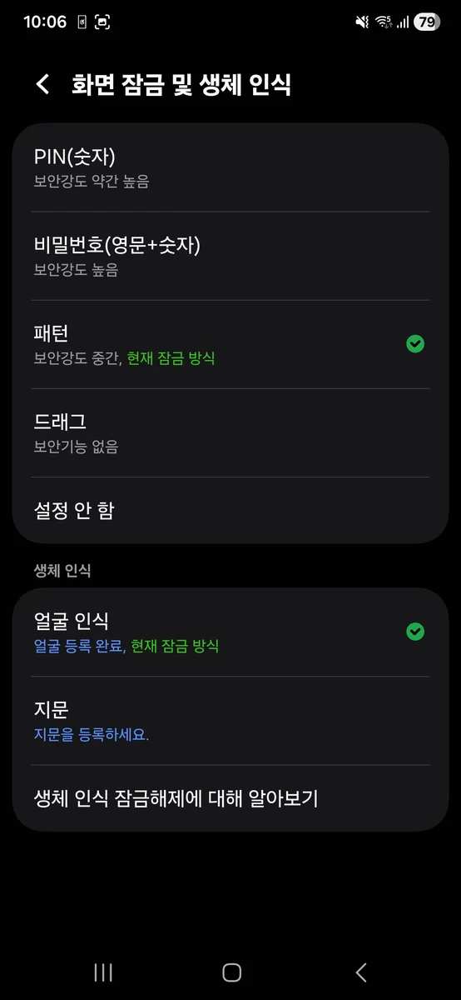
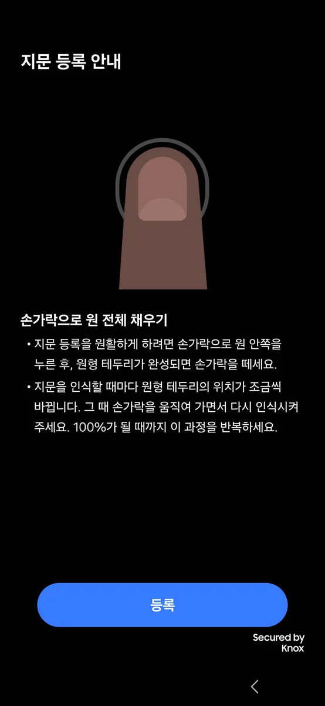
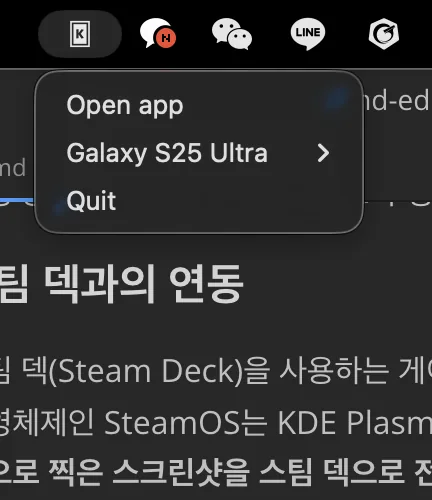
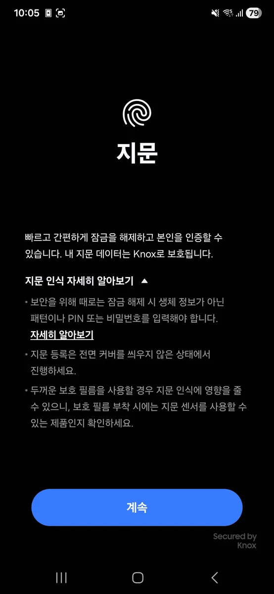

갤럭시 S25 울트라는 분명 훌륭한 디바이스입니다. 그런데 한 가지가 마음에 걸린다면? **지문인식이 생각보다 자주 실패**한다는 것입니다. 온라인 커뮤니티를 보면 "지문인식이 너무 안 된다", "손가락을 여러 번 갖다 대야 겨우 인식된다"는 불만들이 많습니다. 하지만 걱정하지 마세요. 이 글에서는 **지문인식 인식률을 높이는 구체적인 해결법**과 함께, **만약 해결이 안 되면 어떻게 얼굴인식과 패턴잠금으로 편하게 사용할 수 있는지** 완벽하게 알려드리겠습니다.

---

## 갤럭시 S25 울트라 지문인식 인식률 낮음 원인 분석

갤럭시 S25 울트라의 지문인식 문제는 단순한 결함이 아니라 여러 복합적인 원인으로 발생합니다. Reddit와 삼성 커뮤니티를 보면 많은 사용자들이 "처음 등록할 때 이미 문제가 있었다", "손가락을 여러 번 대야 인식된다", "친구의 S25는 잘되는데 내 것만 안 된다"는 불만을 공유하고 있습니다.

**화면 보호필름이 초음파를 방해합니다**

S25 울트라는 **초음파 기술 기반의 지문 센서**를 사용합니다. 초음파 센서는 화면 아래에 있기 때문에, **너무 두꺼운 강화유리 필름이나 저품질 필름**이 초음파를 방해할 수 있습니다. 특히 처음부터 필름을 부착한 상태에서 지문을 등록했다면, 필름을 벗은 후 지문인식이 훨씬 잘될 수 있습니다. 초음파 센서 호환 필름도 있지만, 일반 강화유리 필름은 초음파 신호를 제대로 전달하지 못합니다.

**손가락이 깨끗하지 않으면 인식률이 급격히 떨어집니다**

지문 센서는 **피부와 센서 사이의 물리적 접촉**으로 작동합니다. 손가락에 로션, 땀, 먼지가 있으면 인식률이 급격히 떨어집니다. 특히 겨울철 건조한 피부나 로션을 바른 손가락은 더욱 인식이 안 될 수 있습니다. 또한 손가락이 축축하거나 너무 건조한 경우도 문제가 될 수 있습니다.

**부적절한 등록 방법도 큰 원인입니다**

지문을 등록할 때 **손가락 각도가 일정하지 않거나**, **지문 센서 전체를 덮지 못한 채 등록**했다면 실제 사용 시 인식률이 떨어질 수 있습니다. 또한 한 손가락만 등록했다면, 인식 실패 확률이 높아집니다. 등록 과정에서 손가락을 너무 빠르게 움직이거나 너무 천천히 움직여도 제대로 된 지문 데이터가 저장되지 않을 수 있습니다.

**소프트웨어 오류나 센서 불량일 수도 있습니다**

드물지만 **소프트웨어 버그로 인한 센서 오류** 또는 **하드웨어 불량**일 수도 있습니다. 특히 여러 해결법을 다 시도해도 안 되면 이 가능성이 있습니다.

---

## 지문인식 인식률을 높이는 7가지 해결 방법

**첫 번째 해결법: 화면 보호필름 확인 및 교체**

혹시 화면 보호필름을 부착했다면, 일단 **필름을 벗고 지문인식을 시도**해 보세요. 만약 필름을 벗으면 잘 된다면, 그것이 원인입니다. 필름이 원인이었다면 초음파 센서 호환 필름으로 교체하거나 S25 울트라는 고급형이므로 필름 없이 사용하는 것을 추천합니다. 고래스 필름이나 강화유리 필름 대신 **초음파 호환 필름을 검색하여 구매**하면 됩니다.

**두 번째 해결법: 손가락 청결 관리**

손가락을 깨끗이 닦은 후 지문을 등록해야 합니다. 등록할 때 손가락이 마른 상태인지 확인하고, 로션이나 크림을 바른 손가락은 피해야 합니다. 실제 사용 시에도 지문인식 실패 시 손가락을 옷에 문질러 정전기를 제거하고, 손가락이 젖었으면 물기를 제거한 후 인식하세요. 손가락 피부가 건조하면 약간의 습기가 필요할 수도 있습니다.

**세 번째 해결법: 지문 재등록 (가장 효과적)**

기존 지문을 모두 삭제하고 올바른 방법으로 다시 등록하는 것이 매우 효과적입니다. 설정 앱을 실행한 후 생체 인식 및 보안으로 들어가서 지문 메뉴를 선택합니다. 등록된 지문을 선택하고 삭제 버튼을 누르면 됩니다. 그 다음 지문 추가 버튼을 터치하여 올바르게 다시 등록합니다.

올바른 지문 등록 절차는 다음과 같습니다. 설정 앱을 실행하고 생체 인식 및 보안을 선택한 후 지문을 클릭합니다. 지문 추가 버튼을 터치하고, 가장 중요한 것은 **지문 센서 전체에 손가락을 완전히 덮는 것**입니다. 손가락을 여러 각도로 지문 센서에 누르고, 같은 손가락을 2번 이상 등록하여 인식률을 높입니다. 같은 손가락을 여러 번 등록하면 각도 인식이 다양해져 실제 사용 시 인식률이 크게 증가합니다.

**네 번째 해결법: 터치 민감도 설정 활성화**

터치 민감도를 높이면 지문인식이 더 반응합니다. 설정으로 이동하여 생체 인식 및 보안을 선택한 후 지문으로 들어갑니다. 고급 설정에서 터치 민감도 활성화 옵션을 켜면 매우 가벼운 터치도 인식되므로, 지문인식 성공률이 올라갑니다.

**다섯 번째 해결법: 화면 전환 효과 비활성화**

과도한 애니메이션이 인식을 방해할 수 있습니다. 설정에서 생체 인식 및 보안으로 들어가 지문을 선택한 후 고급 설정에서 화면 전환 효과를 끔으로 설정하세요. 이렇게 하면 불필요한 시각 효과가 제거되어 더 빠른 인식이 가능해집니다.

**여섯 번째 해결법: 소프트웨어 업데이트 확인**

최신 펌웨어로 업데이트하면 지문인식 관련 버그가 수정되었을 수 있습니다. 설정으로 이동하여 정보를 선택한 후 소프트웨어 업데이트에서 설치를 누르면 됩니다. 삼성이 지문인식 관련 버그를 수정한 업데이트를 배포했을 수 있으니 확인해 보세요.

**일곱 번째 해결법: 절전 모드 해제**

절전 모드가 켜져 있으면 센서 성능이 저하될 수 있습니다. 설정에서 배터리 및 기기 관리를 선택한 후 절전 모드를 해제하면 됩니다. 절전 모드에서는 여러 주변 기능들이 제한되기 때문에 지문 센서도 영향을 받을 수 있습니다.

---

## 얼굴인식 등록 및 설정 방법

만약 위의 모든 방법을 시도했는데도 지문인식이 자주 실패한다면, **차라리 얼굴인식과 패턴잠금으로 완벽하게 전환**하는 것을 추천합니다. 사실 많은 사용자들이 "지문인식보다 얼굴인식이 훨씬 빠르고 편하다"고 평가하고 있습니다.

**얼굴인식 설정 단계**

설정 앱을 실행하고 생체 인식 및 보안을 선택합니다. 얼굴인식을 클릭한 후 시작 버튼을 터치하면 됩니다. 화면의 지시에 따라 얼굴을 천천히 좌우로 돌려 등록합니다.

**다양한 상태로 추가 등록하기**

안경을 쓴 모습, 선글라스를 쓴 모습, 마스크를 쓴 모습 등 다양한 상태로 추가 등록하면 실제 사용 시 인식률이 매우 높아집니다. 여러 상황을 등록할수록 인식 확률이 높아지므로, 가능한 한 많은 상황에서 얼굴을 등록하세요.

**얼굴인식의 장점**

얼굴인식은 인식 속도가 매우 빠릅니다. 손가락을 대는 시간도 필요 없이 화면을 켜기만 하면 인식됩니다. 또한 손가락이 젖거나 더러워도 관계없으며, 마스크를 써도 인식 가능합니다. 최신 알고리즘을 사용하기 때문입니다. 어두운 환경에서도 작동하는데, 이는 적외선 카메라를 사용하기 때문입니다.

---

## 패턴잠금 설정 및 활성화

얼굴인식에 패턴잠금을 추가로 설정하는 것이 좋습니다. 이렇게 하면 얼굴인식 실패 시 자동으로 패턴잠금 입력 화면으로 전환되기 때문입니다.

**패턴잠금 설정 방법**

설정 앱을 실행하고 잠금화면 및 보안을 선택합니다. 화면 잠금 방식을 클릭한 후 패턴을 선택하면 됩니다. 패턴 생성 단계에서 4개 이상의 점을 연결하여 패턴을 만듭니다. 안내에 따라 진행하면 됩니다. 같은 패턴으로 한 번 더 입력하여 확인하면 완료됩니다.

**패턴 설정 시 유의사항**

너무 단순한 패턴은 보안 수준이 낮으므로 피하세요. 직선이나 기본적인 도형보다는 복잡한 지그재그 패턴이 좋습니다. 다른 사람이 추측하기 어려운 패턴을 만드는 것이 중요합니다. 혹시 패턴을 잊어버릴 수 있으므로 따로 메모해 두는 것도 좋습니다.

---

## 얼굴인식과 패턴잠금 조합 사용법

**가장 추천하는 설정: 얼굴인식 우선, 패턴잠금 백업**

설정으로 이동하여 잠금화면 및 보안을 선택한 후 보안 잠금 상세설정을 들어갑니다. 여기서 기본 잠금을 얼굴인식으로 활성화하고, 보안 옵션에 패턴잠금을 추가 등록합니다. 자동 잠금 시간을 화면 꺼진 후 5초 후 자동 잠금으로 설정하면 됩니다.

**실제 사용 경험**

평상시에는 얼굴을 향해 화면이 켜지면 즉시 인식되어 잠금 해제됩니다. 이는 매우 빠릅니다. 얼굴인식이 실패한 경우, 예를 들어 마스크를 썼거나 어두운 환경에서는 자동으로 패턴잠금 입력 화면으로 전환됩니다. 추가 보안이 필요한 경우에는 수동으로 패턴을 입력할 수 있습니다.

이렇게 설정하면 **99% 이상의 상황에서 번거롭지 않게 사용** 가능합니다. 지문인식처럼 자주 실패하는 상황이 거의 없어집니다.

---

## 얼굴인식 보안 수준 향상 팁

얼굴인식만으로는 보안이 약할 수 있으니, 다음과 같이 강화해야 합니다.

**얼굴인식 보안 수준 높이기**

설정으로 이동하여 생체 인식 및 보안을 선택한 후 얼굴인식을 선택합니다. 추가 얼굴 데이터 등록 옵션에서 다양한 상황을 추가로 등록합니다. 안경 착용 상태, 선글라스 착용 상태, 마스크 착용 상태, 다양한 조명 환경에서 등록하면 됩니다. 여러 상황을 등록할수록 인식 확률이 높아집니다.

**스와이프 없이 잠금 해제 설정**

설정에서 생체 인식 및 보안으로 들어가 얼굴인식을 선택합니다. 스와이프 없이 잠금 해제 활성화 옵션을 켜면 된다. 이 옵션을 켜면 얼굴이 인식되자마자 화면을 스와이프할 필요 없이 바로 잠금 해제됩니다.

**패턴잠금 보안 강화**

설정에서 잠금화면 및 보안을 선택한 후 보안 잠금 상세설정으로 들어갑니다. 패턴 복잡도를 높임으로 설정하면 보안 수준이 올라갑니다. 패턴을 더 복잡하게 만들어 보안 수준을 높입니다.

---

## A/S가 필요한 경우와 준비물

모든 방법을 시도했는데도 **지문인식이 완전히 작동하지 않는다면**, 하드웨어 불량일 가능성이 있습니다.

**A/S를 받아야 하는 경우**

모든 해결법을 시도했는데도 지문인식이 전혀 작동 안 할 때입니다. 지문 등록 자체가 불가능한 경우도 해당합니다. 지문 센서 부분에 물리적 손상이 있는 경우도 마찬가지입니다. 이러한 상황에서는 제조사 결함일 가능성이 높으므로 A/S 센터를 방문해야 합니다.

**필요한 준비물**

스마트폰을 지참하고, 구매 영수증 또는 증명서를 준비하면 됩니다. 1년 이내 AS는 무상으로 진행됩니다. 신분증도 준비하세요.

---

## 결론: 지문인식은 선택, 얼굴인식은 필수

S25 울트라의 지문인식 인식률이 낮다면, **단순히 문제를 해결하려는 것보다 완전히 다른 보안 방식으로 전환하는 것이 더 현명**할 수 있습니다.

**최종 추천 설정**

얼굴인식을 활성화하고, 패턴잠금을 백업으로 설정합니다. 지문인식은 문제가 많다면 과감히 포기하는 것을 추천합니다. 이렇게 설정하면 대부분의 경우 얼굴 인식만으로 즉시 해제되어 편의성이 극대화됩니다. 얼굴인식 실패 시 패턴잠금으로 자동 전환되므로 안정성도 확보됩니다. 2가지 생체인식과 패턴 조합으로 충분한 보안을 확보할 수 있습니다.

S25 울트라의 **얼굴인식 기술은 정말 훌륭**합니다. 지문인식에 집착할 필요 없이, 더 나은 기술을 활용해 보세요! 이렇게 전환하면 스마트폰 사용 경험이 훨씬 더 부드럽고 쾌적해질 것입니다.

---

#갤럭시S25울트라 #지문인식 #얼굴인식 #패턴잠금 #보안설정 #스마트폰팁 #문제해결
