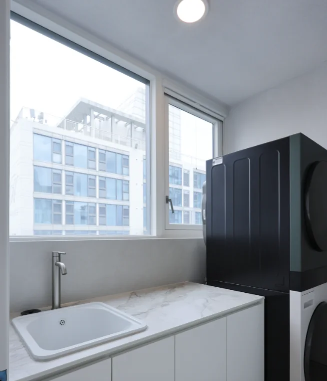
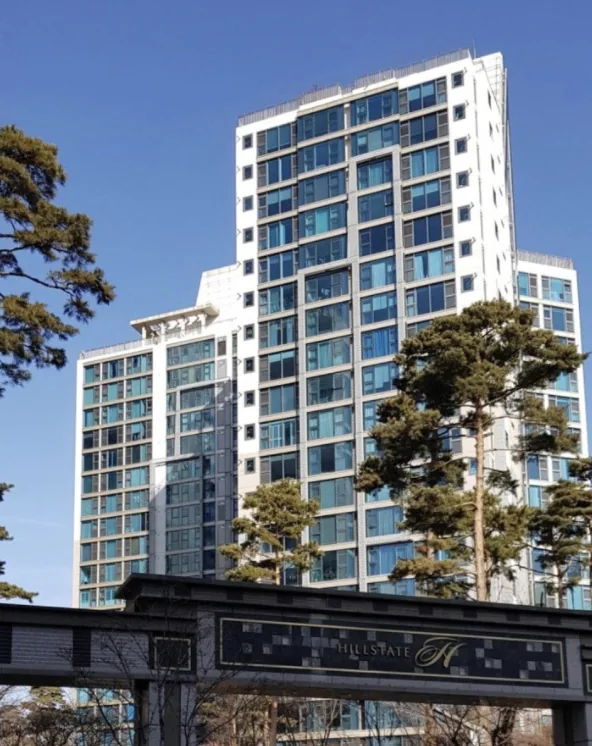
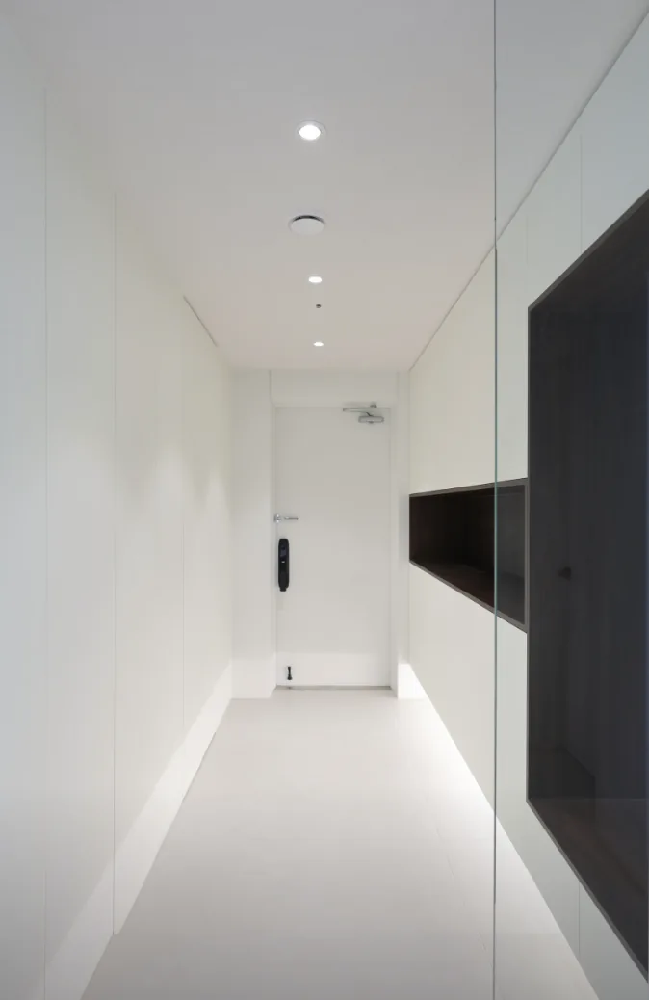

서울숲힐스테이트는 서울 성동구 성수동에 위치한 명실상부 강동·동부권의 대표 프리미엄 아파트입니다. 한강 인근에 위치하면서도 교통이 편리하고, 최근 몇 년간 꾸준히 가격이 상승하고 있어 **투자 가치가 높은 단지**로 평가받고 있습니다. 이 글에서는 서울숲힐스테이트에 대한 모든 정보를 상세히 정리하여, 매매를 고려 중인 분들이 현명한 결정을 내릴 수 있도록 도와드리겠습니다.

[서울숲힐스테이트 네이버지도에서보기](https://map.naver.com/p/search/%EC%84%9C%EC%9A%B8%EC%88%B2%ED%9E%90%EC%8A%A4%ED%85%8C%EC%9D%B4%ED%8A%B8/place/18789488?c=15.00,0,0,0,dh&placePath=/home?bk_query=%EC%84%9C%EC%9A%B8%EC%88%B2%ED%9E%90%EC%8A%A4%ED%85%8C%EC%9D%B4%ED%8A%B8&entry=bmp&from=map&fromPanelNum=2&timestamp=202601151032&locale=ko&svcName=map_pcv5&searchText=%EC%84%9C%EC%9A%B8%EC%88%B2%ED%9E%90%EC%8A%A4%ED%85%8C%EC%9D%B4%ED%8A%B8)

---

## 서울숲힐스테이트의 정확한 위치 및 접근성

서울숲힐스테이트는 **서울특별시 성동구 성수동2가 843번지**에 위치하고 있습니다. 정확한 주소는 **성수일로4길 26**입니다. 이곳은 한강 동쪽 지역에서 가장 주목받는 프리미엄 주거지역 중 하나입니다.

**대중교통 접근성**

정문에서 도보 5분 거리에 성수역(서울 지하철 2호선)이 있습니다. 성수역은 강남역까지 단 3정거장 거리로, 서울 시내 어디든 빠르게 이동할 수 있는 교통의 중심입니다. 강남역까지 약 5분 정도 소요됩니다. 후문에는 버스 정류장이 있어 다양한 노선의 버스를 이용할 수 있습니다. 특히 영동대로, 올림픽대로 인근에 위치하여 자동차 이동도 매우 편리합니다.

**주변 주요 도로**

영동대교와 성수대교 인근에 위치하고 있어서, 강남, 강북 어디로든 빠른 접근이 가능합니다. 올림픽대로를 따라 강변북로, 영동대로로 연결되어 광역 교통이 매우 편리합니다.

---

## 서울숲힐스테이트 단지 기본 정보

**단지 규모 및 구성**

서울숲힐스테이트는 **총 5개 동, 445세대**로 구성되어 있습니다. 이는 중형 규모의 고급 아파트 단지로, 적절한 규모로 인해 관리가 우수하고 단지 분위기가 좋은 것으로 평가받고 있습니다.

**층수 및 주차**

각 동의 층수는 **18층~29층**으로 다양합니다. 일부 저층은 장점이 있고, 고층은 한강 조망이 우수합니다. 주차는 **총 800대**로 세대당 **1.8대 정도의 여유로운 주차가 가능**합니다. 이는 일반 아파트보다 훨씬 많은 수준입니다.

**난방 및 에너지**

개별난방과 도시가스를 사용하므로, 겨울에 따뜻한 온도를 자유롭게 조절할 수 있습니다. 에너지 효율이 좋다는 평가입니다.

**준공 연도**

서울숲힐스테이트는 **2009년에 준공**되었습니다. 현재 기준으로 약 **17년 정도된 건물**로, 단지 내부 시설과 건물 관리 상태가 비교적 양호한 수준입니다. 단지 내에서 정기적인 리모델링과 유지보수가 이루어지고 있습니다.

---

## 평면도 및 평형별 정보

**주요 평형 구성**

서울숲힐스테이트의 평형은 다양하게 구성되어 있습니다. **45평형(전용 약 33m²)**, **55평형(전용 약 43m²)**, **84평형(전용 약 62m²)**, **92평형(전용 약 68m²)**, **118평형(전용 약 87m²)**, **151평형(전용 약 112m²)** 등 다양한 사이즈가 있습니다.

**평형별 구조**

**45평형**: 방 2개, 욕실 1개의 소형 구조로 1인 가구나 신혼부부에게 인기입니다.

**55평형**: 방 3개, 욕실 2개의 구조로 가장 인기 있는 평형입니다. 부부와 자녀 한 명 정도의 가족이 적당한 크기입니다.

**84평형**: 방 3개, 욕실 2개의 더 넓은 구조로 주택 본연의 목적을 충족하기에 충분합니다.

**92평형 이상**: 방 4개 이상의 대형 평형으로 넓은 거실과 충분한 수납공간이 특징입니다.

---

## 분양가 및 현재 시세 분석

**분양 당시 가격**

서울숲힐스테이트가 처음 분양되었을 당시 분양가는 평형과 층수에 따라 다양했습니다. 당시는 **평당 약 1,200만원~1,500만원대**의 분양가로 책정되었습니다.

**현재 시세 (2025년 기준)**

현재 서울숲힐스테이트의 매매 시세는 다음과 같습니다.

**55평형**: 약 **32억원~35억원** (평당 약 7,400만원~8,100만원)

**84평형**: 약 **45억원~50억원** (평당 약 7,200만원~8,000만원)

**92평형**: 약 **50억원~55억원** (평당 약 7,300만원~8,100만원)

**118평형**: 약 **75억원~80억원**대

**151평형**: 약 **100억원 이상**

층수와 조망에 따라 가격 차이가 크게 나타납니다. 한강 조망이 좋은 고층이 같은 평형 저층보다 **3억~5억원 정도 더 비쌉니다**.

**시세차익 규모**

분양가와 현재 시세를 비교하면, **약 20억원 이상의 시세차익**이 발생했습니다. 55평형 기준으로 분양가가 약 12억원대였다면, 현재 32억원대로 올라 **약 2배 이상 상승**했습니다. 이는 서울숲힐스테이트가 얼마나 가치 있는 부동산인지를 보여줍니다.

---

## 전세 시세 및 월세 정보

**전세 시세**

55평형 기준 전세 시세는 약 **10억원~12억원**대입니다. 더 넓은 평형은 더 높은 수준입니다. 연세가 있는 건물이지만 위치가 좋아서 전세로도 꽤 높은 가격이 형성되어 있습니다.

**월세 시세**

월세는 **담보금 1억원 + 월세 50만원~80만원**대의 형태가 일반적입니다. 평형이 크면 담보금과 월세가 비례적으로 증가합니다.

---

## 주변 편의시설 및 생활환경

**쇼핑 편의시설**

단지 정문 바로 옆에 **이마트가 위치**하고 있어, 도보 **1분 거리**에서 마트 이용이 가능합니다. 이는 주민들의 생활 편의성을 크게 높입니다. 그 외에도 성수동 상권에는 다양한 카페, 음식점, 편의점이 있습니다.

**교육 시설**

단지 내에 **어린이집**이 있어 유아 교육이 편리합니다. 주변에는 성동초등학교, 성동중학교 등 여러 학교가 있습니다. 단지 내 문화센터와 독서실도 있어 자녀 교육 환경이 좋습니다.

**의료 시설**

성수역 인근에 병원과 의료시설이 잘 갖춰져 있습니다. 응급 상황 시에도 신속하게 대응할 수 있는 병원들이 많습니다.

**공원 및 휴식 공간**

서울숲공원이 인근에 있어, 산책과 운동을 위한 공간이 충분합니다. 한강공원도 접근성이 좋아서 자연을 즐길 수 있습니다.

**단지 내 시설**

서울숲힐스테이트 단지 내에는 **헬스장, 골프연습장, GX룸, 탁구장, 주민카페, 독서실, 샤워실** 등 다양한 편의시설이 있습니다. 웰브릿지라는 전문 운영업체에서 관리하고 있어서 시설 품질이 우수합니다. 유아 놀이방도 있어서 어린 자녀가 있는 가족에게 좋습니다.

---

## 투자 관점에서의 가치 평가

**강점**

서울숲힐스테이트는 한강 인근 프리미엄 입지, 성수역 근처의 우수한 교통, 다양한 편의시설이 갖춰진 생활환경을 모두 갖추고 있습니다. 실거래 기록이 많아서 매매 시 수월한 편입니다. 층수와 조망에 따른 가격 차등이 명확해서 투자 목표에 맞춘 선택이 가능합니다.

**약점**

2009년 준공으로 연식이 약 17년 정도된 건물입니다. 앞으로 리모델링이나 재건축 가능성에 대해 살펴봐야 합니다. 또한 평형대별로 시세가 다르게 형성되어 있어서, 투자 시 평형 선택이 중요합니다.

**결론**

서울숲힐스테이트는 **서울 동부권의 대표적인 고급 주거지역**으로, 교통, 편의시설, 생활환경 모든 면에서 우수한 단지입니다. 분양 이후 꾸준히 가격이 상승해온 것으로 보아 투자 가치가 충분한 단지로 평가됩니다. 특히 **한강 조망이 좋은 고층**은 시세가 계속 상승할 가능성이 높습니다.

---

#서울숲힐스테이트 #성동구 #아파트정보 #시세 #부동산투자 #강동 #프리미엄아파트
