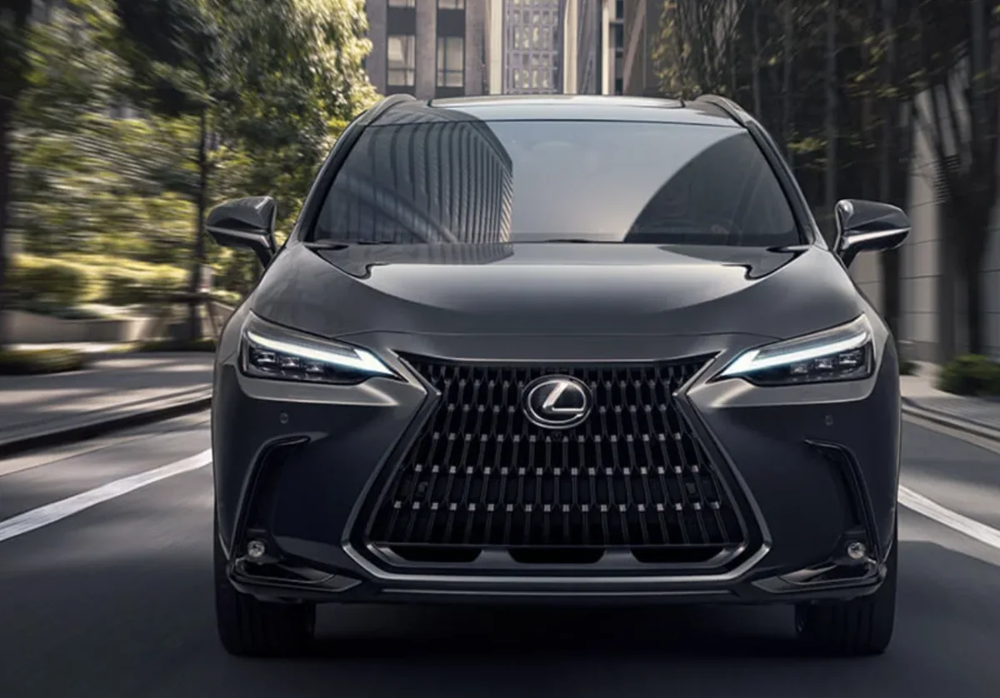
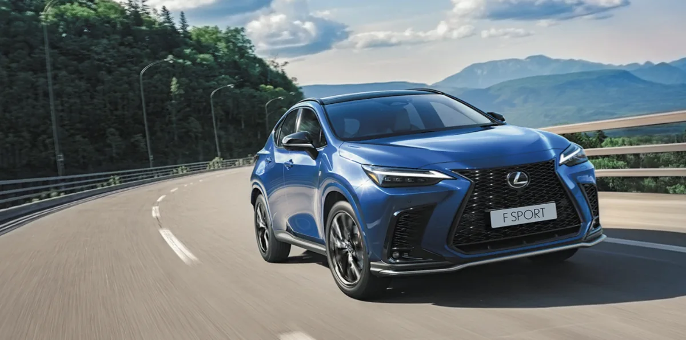
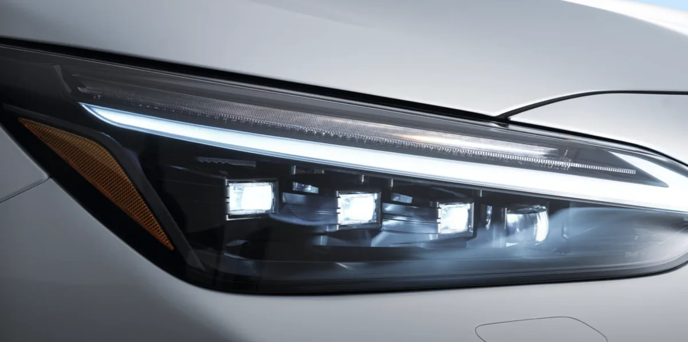
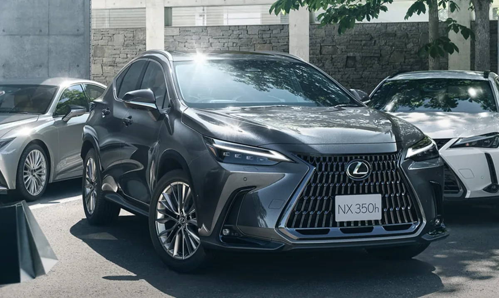

렉서스 NX는 프리미엄 중형 SUV 시장에서 꾸준히 사랑받는 스테디셀러입니다. 독일 3사가 지배하는 시장에서 하이브리드 연비와 검증된 내구성으로 자신만의 입지를 굳건히 지켜왔죠. 2026년형 NX350h가 출시되면서 라인업에 의미 있는 변화가 생겼습니다.

이번 글에서는 2026년형 렉서스 NX350h의 주요 변경점을 살펴보고, 많은 분들이 고민하는 프리미엄과 럭셔리 트림의 차이를 꼼꼼히 비교해 드리겠습니다. 구매를 고려 중이시라면 끝까지 읽어보시길 권합니다.

## 2026년형 렉서스 NX350h 주요 변경점

2026년형 NX 라인업에서 가장 눈에 띄는 변화는 기본형 NX 250의 단종입니다. 2.5리터 자연흡기 가솔린 엔진을 탑재했던 엔트리 모델이 사라지면서, NX의 시작 가격이 약 600만 원 이상 상승했습니다. 이로써 새로운 엔트리 모델은 2.4리터 터보 엔진의 NX 350이 담당하게 되었습니다.

반면 하이브리드 라인업은 오히려 강화되었습니다. NX 350h에 전륜구동(FWD) 모델이 새롭게 추가된 것이 대표적입니다. 기존에는 AWD만 제공했지만, 이제 보다 저렴하고 연비 효율이 높은 선택지가 생긴 셈입니다. FWD 모델은 복합연비 17.0km/L를 달성하며, AWD 대비 약 200만 원 정도 저렴한 가격에 구매할 수 있습니다.

파워트레인 측면에서도 개선이 있었습니다. 2025년형부터 적용된 4세대 하이브리드 트랜스액슬이 2026년형에도 이어집니다. 기존 대비 소형화 및 경량화를 이루었고, 뒷좌석 방음 소재도 보강되어 정숙성이 한층 개선되었습니다.

## NX350h 프리미엄 트림 살펴보기

NX350h 프리미엄은 약 6,700만 원대에 구매할 수 있는 기본 트림입니다. 기본 트림이라고 해서 사양이 부실한 것은 아닙니다. 14인치 고해상도 터치 디스플레이, 통풍 및 열선 시트, 스마트키, LED 헤드램프 등 일상 주행에 필요한 대부분의 편의사양이 갖춰져 있습니다.

20인치 휠이 기본 적용되어 시각적 만족도도 높은 편입니다. E-Four 시스템을 통해 전후륜 구동력을 100:0에서 최대 20:80까지 유연하게 배분하며, 미끄러운 노면에서도 안정적인 주행이 가능합니다. 2.5리터 엔진과 하이브리드 시스템의 합산 출력은 242마력이며, 공인 복합연비는 14.0km/L입니다. 다만 실주행에서는 16~18km/L, 운전 습관에 따라 20km/L까지도 가능하다는 것이 오너들의 공통된 평가입니다.

## NX350h 럭셔리 트림의 추가 사양

럭셔리 트림은 프리미엄 대비 약 1,000만 원 높은 7,600만 원대에 형성되어 있습니다. 가격 차이만큼 추가되는 사양들이 있으니 본인에게 필요한 옵션인지 꼼꼼히 따져봐야 합니다.

럭셔리 트림에서 추가되는 핵심 사양은 다음과 같습니다. 파노라마 선루프가 적용되어 개방감이 크게 향상됩니다. 헤드업 디스플레이(HUD)가 추가되어 시선 이동 없이 속도와 내비게이션 정보를 확인할 수 있습니다. 마크 레빈슨 프리미엄 오디오 시스템이 탑재되어 음향 품질이 한 단계 올라갑니다. 360도 어라운드 뷰 모니터와 디지털 룸미러도 럭셔리 트림에서만 제공됩니다.

트리플 빔 LED 헤드라이트가 적용되어 야간 시인성이 향상되고, 외관상으로도 더 고급스러운 인상을 줍니다. 사이드미러에 사각지대 경고등이 추가되는 것도 럭셔리 트림만의 특징입니다.

## 프리미엄과 럭셔리 어떤 트림을 선택해야 할까

두 트림 사이에서 고민하는 분들이 많습니다. 결론부터 말씀드리면, 본인의 운전 습관과 우선순위에 따라 선택이 달라집니다.

프리미엄 트림을 추천하는 경우는 이렇습니다. 선루프를 자주 사용하지 않거나, 오디오 음질에 크게 민감하지 않은 분이라면 프리미엄으로도 충분합니다. 1,000만 원의 가격 차이를 다른 곳에 활용하고 싶은 분들에게도 프리미엄이 합리적인 선택입니다. 기본 10스피커 오디오도 일상적인 음악 감상에는 부족함이 없습니다.

럭셔리 트림을 추천하는 경우도 있습니다. 파노라마 선루프의 개방감을 중요하게 생각하거나, 마크 레빈슨 오디오로 고품질 음악을 즐기고 싶은 분이라면 럭셔리가 맞습니다. 주차 환경이 까다롭거나 후방 시야 확보가 어려운 곳에서 자주 운전한다면 360도 어라운드 뷰와 디지털 룸미러가 큰 도움이 됩니다. HUD 역시 한번 경험하면 없이는 불편하다는 평가가 많습니다.

## 구매 전 체크리스트

렉서스 NX350h 구매를 결정하기 전에 몇 가지 사항을 점검해 보시길 권합니다.

시승은 필수입니다. 하이브리드 특유의 주행감과 eCVT 변속기의 느낌은 직접 경험해봐야 알 수 있습니다. 급가속 시 엔진 소음이 커지는 앳킨슨 사이클 엔진의 특성도 미리 체험해 보세요. 대부분의 실용 구간에서는 모터 개입이 잦아 정숙하지만, 풀가속 상황에서의 소음은 호불호가 갈릴 수 있습니다.

경쟁 모델과의 비교도 필요합니다. 제네시스 GV70은 인테리어에서, BMW X3와 아우디 Q5는 섀시 성능에서, 벤츠 GLC는 브랜드 가치에서 각각 강점을 보입니다. NX350h는 이 모든 영역에서 평균 이상을 달성하면서 뛰어난 연비와 내구성을 더한 모델입니다. 본인이 가장 중요하게 생각하는 가치가 무엇인지 먼저 정리해 보세요.

출고 대기 기간도 확인하세요. 인기 트림과 색상 조합에 따라 대기 기간이 크게 달라질 수 있습니다. 원하는 시기에 차량을 받기 위해서는 미리 계약을 진행하는 것이 좋습니다.

## 마무리

2026년형 렉서스 NX350h는 기본형 단종으로 진입 가격이 올랐지만, 하이브리드 라인업 강화와 FWD 모델 추가로 오히려 선택의 폭이 넓어졌습니다. 프리미엄 트림은 합리적인 가격에 충실한 기본기를 갖췄고, 럭셔리 트림은 1,000만 원 추가 투자로 확실한 프리미엄 경험을 제공합니다.

검증된 하이브리드 시스템의 연비와 내구성, 그리고 렉서스 특유의 정숙한 승차감을 원한다면 NX350h는 여전히 매력적인 선택입니다. 본인의 예산과 필요한 옵션을 꼼꼼히 따져보고 현명한 결정 내리시길 바랍니다.

#렉서스NX350h #2026년형렉서스 #하이브리드SUV #렉서스프리미엄 #렉서스럭셔리 #NX350h연비 #중형SUV추천
