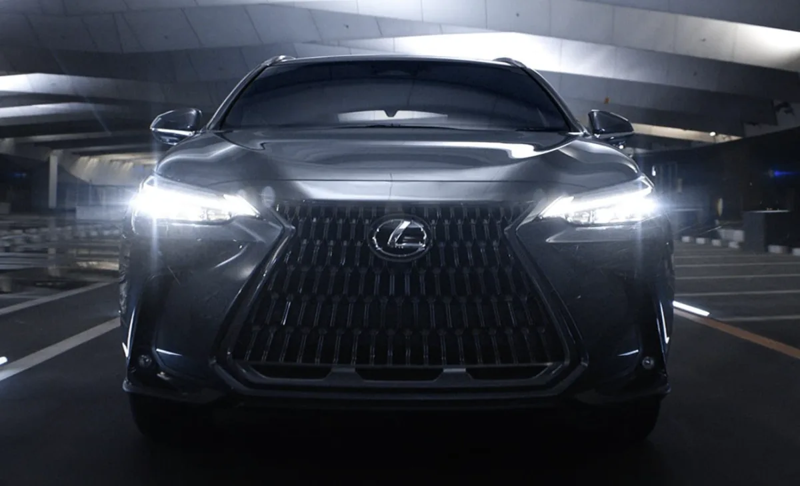
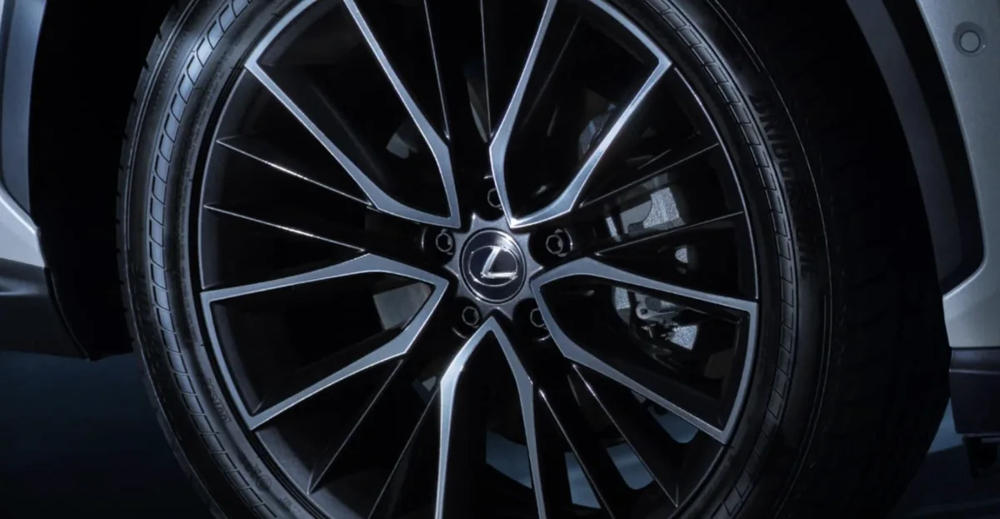
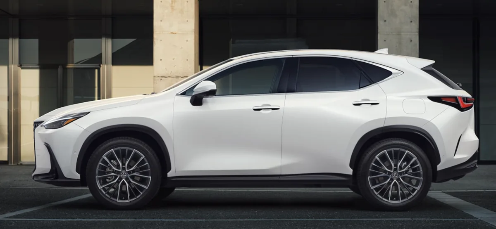

렉서스 NX350h는 프리미엄 하이브리드 SUV 시장에서 꾸준한 인기를 누리고 있습니다. 뛰어난 연비와 정숙성, 검증된 내구성으로 많은 소비자들이 관심을 갖는 모델이죠. 하지만 신차 가격이 만만치 않다 보니 중고차를 고려하는 분들도 많습니다.

이번 글에서는 2026년형 렉서스 NX350h의 신차 가격과 트림별 차이점, 2022년 풀체인지 당시 달라진 점, 그리고 현재 중고차 시세까지 구매를 고려하는 분들이 알아야 할 모든 정보를 총정리했습니다. 자세한 후기와 시승후기 모음은 앞의 포스팅을 확인하시기 바랍니다.

## 2026년형 NX350h 신차 가격

2026년형 렉서스 NX350h는 프리미엄과 럭셔리 두 가지 트림으로 판매됩니다. 국내 판매 가격은 개소세 적용 여부에 따라 변동이 있을 수 있으니 구매 시점에 정확한 가격을 확인하시기 바랍니다.

NX350h 프리미엄 트림은 약 6,695만 원에서 시작합니다. 기본 트림이지만 14인치 터치 디스플레이, 통풍 및 열선 시트, 20인치 휠, E-Four 사륜구동 시스템 등 핵심 사양이 충실하게 갖춰져 있습니다. 일상 주행에 필요한 편의사양은 대부분 포함되어 있어 가성비를 중시하는 분들에게 적합합니다.

NX350h 럭셔리 트림은 약 7,613만 원입니다. 프리미엄 대비 약 920만 원 높은 가격이지만, 파노라마 선루프, 헤드업 디스플레이, 마크 레빈슨 프리미엄 오디오, 360도 어라운드 뷰 모니터, 디지털 룸미러, 트리플 빔 LED 헤드라이트 등이 추가됩니다. 프리미엄 경험을 원하는 분들에게 권할 만한 트림입니다.

## 2026년형 주요 변경사항

2026년형 NX 라인업에는 몇 가지 의미 있는 변화가 있었습니다. 가장 큰 변화는 기본형 NX 250의 단종입니다. 2.5리터 자연흡기 엔진을 탑재한 엔트리 모델이 사라지면서 NX의 진입 가격이 전체적으로 상승했습니다.

하이브리드 라인업은 오히려 강화되었습니다. NX350h에 전륜구동(FWD) 모델이 새롭게 추가되어 선택의 폭이 넓어졌습니다. FWD 모델은 AWD 대비 약 200만 원 저렴하면서 복합연비 17.0km/L를 달성합니다. 사륜구동이 꼭 필요하지 않은 분들에게는 합리적인 대안이 될 수 있습니다.

플러그인 하이브리드 모델인 NX 450h+에도 프리미엄 트림이 신설되었습니다. 기존에는 럭셔리 트림만 있어 가격 부담이 컸는데, 프리미엄 트림 추가로 약 8,000만 원대 초반에서 PHEV를 만나볼 수 있게 되었습니다.

## NX 450h+ 가격 및 특징

전기 충전이 가능한 플러그인 하이브리드 모델인 NX 450h+도 함께 살펴보겠습니다. NX 450h+ 프리미엄은 약 7,989만 원, 스포츠 트림은 약 8,231만 원에 판매됩니다.

NX 450h+는 1회 충전으로 약 56km의 전기 주행이 가능합니다. 출퇴근 거리가 짧다면 평소에는 전기차처럼 사용하고, 장거리 주행 시에는 하이브리드 모드로 전환하는 방식으로 운용할 수 있습니다. 시스템 총출력은 약 309마력으로 NX350h보다 강력한 동력 성능을 제공합니다.

다만 배터리 탑재로 인해 공차중량이 2,030kg으로 NX350h 대비 약 180kg 무거워집니다. 트렁크 공간도 다소 줄어들기 때문에 본인의 사용 패턴을 고려해서 선택해야 합니다.

## 2022년 풀체인지 무엇이 달라졌나

현재 판매 중인 NX350h는 2022년 풀체인지된 2세대 모델입니다. 1세대 NX300h에서 7년 만에 완전 변경되면서 디자인과 플랫폼, 파워트레인까지 전면적인 업그레이드가 이루어졌습니다.

외관에서 가장 눈에 띄는 변화는 스핀들 바디 디자인입니다. 기존의 스핀들 그릴이 차체와 더욱 일체화된 형태로 진화했고, L자형 주간주행등과 일자형 리어 램프로 세련된 인상을 갖게 되었습니다. 후면에는 LEXUS 레터링이 새겨져 브랜드 아이덴티티를 강조합니다.

플랫폼은 TNGA GA-K로 변경되어 무게 중심이 낮아지고 차체 강성이 높아졌습니다. 전장은 4,660mm, 휠베이스는 2,690mm로 1세대 대비 각각 20mm, 30mm 늘어났습니다. 덕분에 2열과 트렁크 공간이 개선되었습니다.

실내에서는 14인치 터치 디스플레이가 도입된 것이 가장 큰 변화입니다. 기존 모델은 터치가 지원되지 않아 불편하다는 평가가 많았는데, 이 부분이 완전히 개선되었습니다. 전자식 도어 핸들인 e-Latch 시스템도 적용되어 미래지향적인 느낌을 더했습니다.

## 중고차 시세 현황

렉서스 NX350h 2세대의 중고차 시세는 연식과 주행거리, 트림에 따라 다양하게 형성되어 있습니다. 2026년 1월 기준 엔카 매물을 토대로 시세를 정리했습니다.

2022년식 프리미엄 트림은 주행거리 9만km 내외 기준 약 5,300~5,500만 원대에 거래되고 있습니다. 신차 대비 약 1,200만 원 정도 저렴한 가격으로, 초기 감가를 피하고 싶은 분들에게 매력적인 선택지입니다.

2023~2024년식 프리미엄 트림은 주행거리 2~3만km 기준 약 5,700~6,000만 원대입니다. 비교적 최근 연식이면서 신차 대비 700~1,000만 원 정도 저렴하게 구매할 수 있습니다. 무사고 차량의 경우 프리미엄이 붙어 가격이 조금 더 높게 형성됩니다.

2024~2025년식 럭셔리 트림은 주행거리 1만km 미만 기준 약 6,900~7,000만 원대입니다. 신차와 큰 차이가 없는 가격이지만, 출고 대기 없이 바로 인수할 수 있다는 장점이 있습니다.

## 중고차 구매 시 체크포인트

렉서스 NX350h 중고차를 구매할 때 몇 가지 확인해야 할 사항이 있습니다.

하이브리드 배터리 상태가 가장 중요합니다. 렉서스 하이브리드 배터리는 내구성이 뛰어나기로 유명하지만, 주행거리가 많은 차량은 배터리 성능 저하 가능성을 고려해야 합니다. 계기판에서 하이브리드 시스템 경고등 유무를 확인하고, 시승 시 전기모터 전환이 부드럽게 이루어지는지 체크하세요.

성능점검 기록부와 보험 이력 조회는 필수입니다. 특히 전면부나 후면부 사고 이력이 있는 차량은 하이브리드 시스템에 영향을 줄 수 있으므로 주의가 필요합니다. 무사고 차량일수록 프리미엄이 붙지만 장기적으로 안심하고 탈 수 있습니다.

런플랫 타이어 교체 여부도 확인하세요. 순정 런플랫 타이어는 약 3~4만km 주행 시 교체가 필요하고, 가격이 비싼 편입니다. 이전 오너가 일반 타이어로 교체한 경우도 있으니 현재 장착된 타이어 상태와 종류를 확인하세요.

## 신차와 중고차 어떤 선택이 유리할까

신차와 중고차 중 어떤 선택이 더 유리한지는 개인의 상황에 따라 다릅니다.

신차를 추천하는 경우는 최신 연식의 개선 사항을 누리고 싶거나, 본인이 원하는 색상과 옵션 조합으로 주문하고 싶은 분입니다. 또한 제조사 보증을 처음부터 온전히 받고 싶거나, 이전 사용자의 관리 상태가 걱정되는 분에게는 신차가 맞습니다.

중고차를 추천하는 경우는 초기 감가를 피하고 싶거나, 출고 대기 없이 바로 차량을 인수하고 싶은 분입니다. 신차 대비 700~1,500만 원 정도 저렴하게 구매할 수 있어 예산이 제한적인 경우에도 좋은 선택입니다. 렉서스는 내구성이 뛰어나 중고차로 구매해도 오래 탈 수 있다는 점도 장점입니다.

## 마무리

렉서스 NX350h는 신차 기준 6,695~7,613만 원, 중고차는 연식과 상태에 따라 5,300~7,000만 원대에 구매할 수 있습니다. 2022년 풀체인지 이후 디자인과 실내 편의성이 크게 개선되었고, 2026년형에서는 FWD 하이브리드 추가와 PHEV 프리미엄 트림 신설로 선택의 폭이 넓어졌습니다.

구매를 결정하기 전에 반드시 시승을 해보시고, 본인의 예산과 필요한 사양을 꼼꼼히 따져보시기 바랍니다. 신차든 중고차든 렉서스 NX350h는 오랜 기간 만족하며 탈 수 있는 신뢰도 높은 선택입니다. 시승후기는 앞의 포스팅에서 확인할 수 있습니다.

#렉서스NX350h #NX350h가격 #렉서스NX중고 #하이브리드SUV #2026년형NX #NX350h시세 #프리미엄SUV
