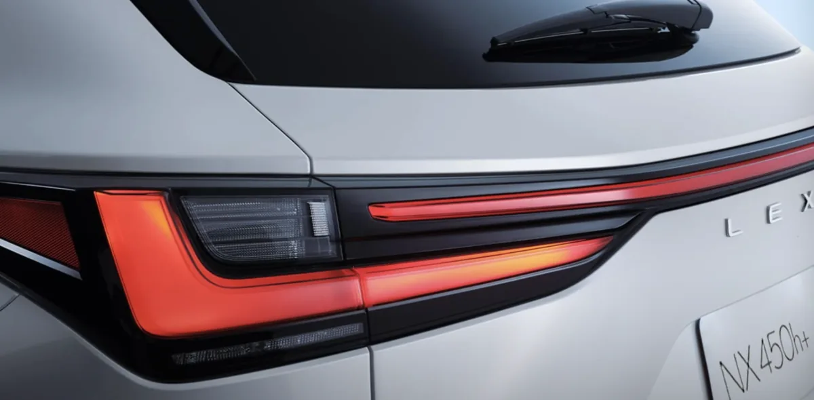
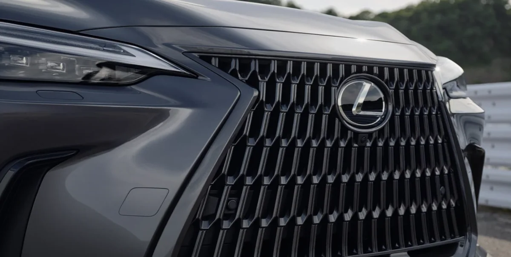
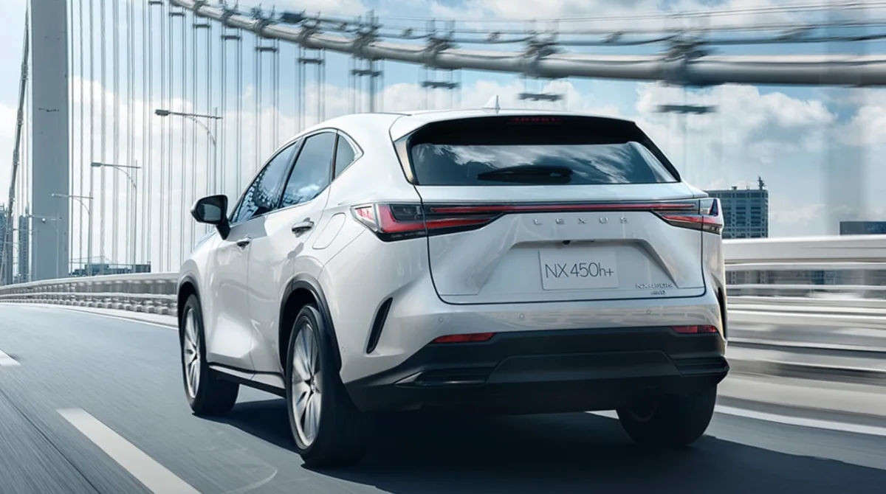

프리미엄 중형 SUV 시장에서 렉서스 NX350h는 독특한 위치를 차지하고 있습니다. BMW X3, 벤츠 GLC, 제네시스 GV70 같은 경쟁 모델들이 스포티함이나 브랜드 가치를 내세울 때, NX350h는 하이브리드 연비와 정숙성이라는 무기로 자신만의 영역을 구축해 왔습니다.

실제로 NX350h를 선택한 오너들은 어떤 점에 만족하고, 어떤 부분을 아쉬워할까요? 이번 글에서는 실오너들의 생생한 후기를 바탕으로 NX350h의 장점과 단점을 솔직하게 정리해 보겠습니다. 신차/중고차 시세는 앞의 포스팅에서 확인할 수 있습니다.

## 압도적인 정숙성이 최대 강점

NX350h를 타본 사람들이 공통적으로 꼽는 첫 번째 장점은 정숙성입니다. 2.5리터 하이브리드 파워트레인은 시스템 총출력 242마력을 발휘하면서도, 도심 주행 시 마치 전기차를 타는 듯한 조용함을 선사합니다. 저속 구간에서는 전기모터가 주로 작동하기 때문에 엔진 소음이 거의 없고, 모터와 엔진의 전환 과정도 매끄러워 변속 충격이 느껴지지 않습니다.

2025년형부터는 뒷좌석 방음 소재가 보강되어 청각적 만족도가 더욱 높아졌습니다. 고속도로 주행 시에도 풍절음과 로드노이즈가 잘 억제되어 장거리 운전의 피로도를 크게 낮춰줍니다. 동급 경쟁 모델인 GV70과 비교해도 정숙성 면에서는 NX350h가 앞선다는 평가가 많습니다.

## 공인연비를 뛰어넘는 실연비

NX350h의 공인 복합연비는 14.0km/L입니다. 숫자만 보면 평범해 보이지만, 실제 도로에서는 이야기가 달라집니다. 대부분의 오너들이 도심 주행에서 16~18km/L를 기록하고, 연비 운전에 신경 쓰는 경우 20km/L까지도 달성합니다. 고속 주행에서도 18~19km/L 수준을 유지하는 것이 렉서스 하이브리드의 특징입니다.

이 같은 고효율은 앳킨슨 사이클 엔진과 직분사 및 포트분사를 병행하는 D-4S 시스템 덕분입니다. 플러그인 하이브리드와 달리 별도의 충전 없이도 이 정도 연비를 누릴 수 있어 실용성 면에서 높은 점수를 받습니다. 주유소 방문 횟수가 확연히 줄어들기 때문에 유지비 걱정을 덜 수 있습니다.

## 편안함에 초점을 맞춘 승차감

NX350h의 승차감은 전형적인 컴포트 지향입니다. 노면의 자잘한 진동을 뭉툭하게 걸러내 일상 주행에서의 피로도를 낮춰줍니다. 시트 설계도 장거리 운전에 최적화되어 있어서, 몇 시간을 운전해도 허리나 엉덩이에 불편감이 적다는 후기가 많습니다.

SUV임에도 불구하고 세단에 가까운 안락함을 제공한다는 평가를 받습니다. 고속 주행 시에도 차체가 안정적으로 노면을 누르는 느낌을 주며, 직진 안정성이 뛰어나 스티어링 휠을 자주 보정할 필요가 없습니다. 다만 큰 요철이나 방지턱을 넘을 때는 서스펜션이 다소 단단하게 버티는 성향이 있어, 독일 프리미엄 SUV 대비 충격 흡수력이 약간 떨어진다는 의견도 있습니다.

## E-Four 사륜구동의 안정감

전 트림에 기본 탑재된 E-Four 전자식 사륜구동 시스템도 NX350h의 강점입니다. 이 시스템은 전륜에 2개의 모터와 후륜에 1개의 모터를 갖추고 있으며, 전후륜 구동력을 100:0에서 최대 20:80까지 유연하게 배분합니다. 기계식 드라이브 샤프트 없이 후륜 모터로 뒷바퀴를 구동하는 방식이라 구조가 단순하고 효율적입니다.

우천 시나 눈길에서 접지력이 뛰어나고, 코너링 시에도 균형 잡힌 거동을 보여줍니다. 일상 주행에서 사륜구동의 이점을 체감하기 어려울 수 있지만, 미끄러운 노면이나 급한 경사로에서 그 진가가 드러납니다. 한국의 사계절 기후 환경을 고려하면 실용적인 선택입니다.

## 급가속 시 엔진 소음은 아쉬운 부분

NX350h의 가장 큰 단점으로 지목되는 것은 급가속 시 발생하는 날카로운 엔진 소음입니다. 연비 효율을 높이기 위한 앳킨슨 사이클 엔진의 특성상, 풀가속 상황에서는 엔진이 고회전까지 올라가며 소음이 커집니다. CVT 변속기와 결합되어 엔진 회전수가 먼저 치솟는 특유의 러버밴드 현상도 느껴집니다.

물론 일상적인 주행에서는 모터 개입이 잦아 이런 소음을 접할 기회가 많지 않습니다. 하지만 고속도로 합류나 추월 상황에서 액셀을 깊게 밟으면 정숙했던 실내가 갑자기 시끄러워지는 경험을 하게 됩니다. 이 부분은 토요타와 렉서스 하이브리드 차량의 공통적인 특성이기도 합니다.

## 스포티한 주행을 기대하면 실망할 수 있다

NX350h는 편안함에 초점을 맞춘 차량입니다. 터보 엔진을 탑재한 경쟁 모델들과 비교하면 가속이나 핸들링이 덜 날카롭습니다. 0-100km/h 가속 시간은 7.6초 내외로 수치상으로는 나쁘지 않지만, 체감상 차가 굼뜨거나 답답하게 느껴질 수 있습니다.

스포티한 주행 감각을 원하는 분이라면 BMW X3나 아우디 Q5 쪽을 살펴보는 것이 맞습니다. 반면 부드럽고 효율적인 주행을 선호하고, 연비와 유지비를 중요하게 생각한다면 NX350h가 좋은 선택입니다. 차량의 성격을 명확히 이해하고 구매하는 것이 중요합니다.

## 2열 공간과 편의사양의 아쉬움

NX350h의 2열 공간은 넉넉한 편이지만, 동급 경쟁 모델 대비 다소 협소하다는 평가가 있습니다. 3인 가족이 타기에는 충분하지만, 성인 3명이 2열에 앉으면 어깨가 닿을 수 있습니다. 장거리 여행 시 2열 승객의 편의를 중요하게 생각한다면 한 급 위 모델인 RX를 고려해볼 만합니다.

편의사양 측면에서도 아쉬운 부분이 있습니다. 서라운드 뷰 모니터나 헤드업 디스플레이 같은 기능이 프리미엄 트림에는 빠져 있어, 이를 원한다면 약 1,000만 원 비싼 럭셔리 트림을 선택해야 합니다. 또한 국내에서는 앱을 통한 원격 시동 기능이 지원되지 않아, 스마트카 기능을 기대하는 분들에게는 아쉬움으로 남습니다.

## 런플랫 타이어의 호불호

NX350h에는 런플랫 타이어가 기본 장착됩니다. 펑크가 나도 일정 거리를 주행할 수 있어 안전성 측면에서는 장점이지만, 승차감에는 부정적인 영향을 줍니다. 일반 타이어 대비 단단한 사이드월 때문에 노면 충격이 더 직접적으로 전달됩니다.

일부 오너들은 런플랫 타이어를 일반 타이어로 교체하고 펑크 수리 키트를 구비하는 방식을 선택하기도 합니다. 타이어 교체 시 승차감이 확연히 부드러워졌다는 후기가 많습니다. 다만 20인치 휠에 맞는 타이어 선택폭이 넓지 않은 점은 참고해야 합니다.

## 마무리

렉서스 NX350h는 정숙성과 연비라는 두 마리 토끼를 모두 잡은 프리미엄 하이브리드 SUV입니다. 도심에서 조용하고 효율적인 주행을 원하고, 검증된 내구성과 낮은 유지비를 중요하게 생각하는 분에게 최적의 선택입니다. 렉서스 특유의 신뢰성 덕분에 한번 구매하면 10년 이상 큰 고장 없이 탈 수 있다는 점도 큰 장점입니다.

반면 스포티한 주행감이나 날카로운 가속을 원한다면 다른 선택지를 살펴보는 것이 좋습니다. 급가속 시 엔진 소음, 2열 공간의 아쉬움, 일부 편의사양의 부재도 구매 전 고려해야 할 부분입니다. 본인의 운전 스타일과 우선순위를 명확히 정리한 후 결정하시길 바랍니다. 중고차/신차 시세에 대해 다른 앞의 포스팅에 이어 이번 포스팅에서는 렉서스 NX350h  정숙성과 연비에 대해 알아봤습니다.

#렉서스NX350h #NX350h장단점 #렉서스하이브리드 #NX350h연비 #NX350h정숙성 #프리미엄SUV #하이브리드SUV추천
