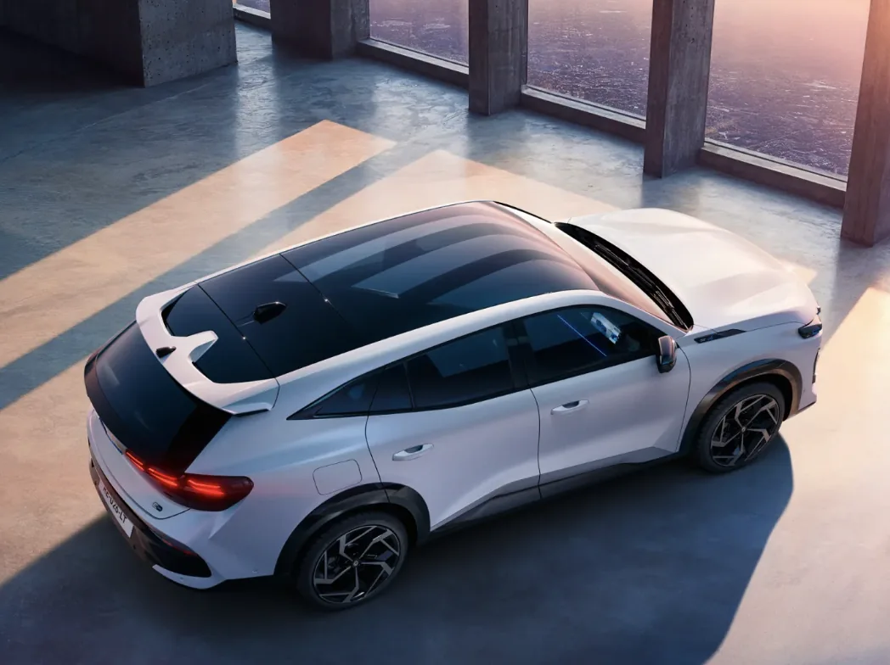
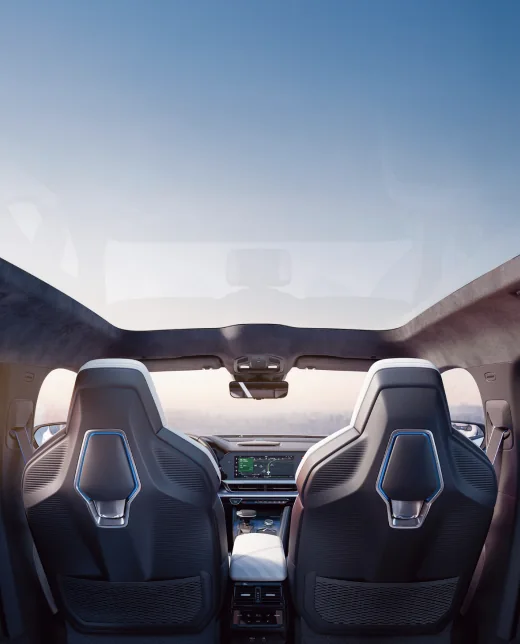

**2026년 1월**, 르노코리아가 오로라 프로젝트의 두 번째 모델 **필랑트(Filante)**를 세계 최초로 공개했습니다. 그랑 콜레오스의 성공을 이어갈 플래그십 크로스오버로, **4,331만 원**부터 시작하는 가격이 화제입니다. 필랑트는 세단의 우아함과 SUV의 실용성을 결합한 크로스오버입니다. **250마력 E-Tech 하이브리드** 시스템과 **복합연비 15.1km/L**를 갖추고, 기본 트림부터 풍부한 사양을 제공합니다. 이 글에서는 트림별 가격과 옵션을 상세히 비교하고, 어떤 트림이 가장 합리적인 선택인지 분석합니다.

[필랑트 가격정보](https://cdn.renault.co.kr/upload/asset/price/price_filante_202601.pdf)

## 르노 필랑트 트림별 가격 한눈에 보기

**[르노코리아 필랑트 공식 페이지](https://www.renault.co.kr/ko/model/filante_overview.jsp)**

필랑트는 총 4개 트림으로 구성됩니다. 아래 가격은 **개별소비세 인하 및 친환경차 세제 혜택 적용 기준**입니다.**테크노** 트림은 **4,331만 9,000원**으로 기본 트림입니다. **아이코닉** 트림은 **4,696만 9,000원**으로 테크노 대비 365만 원 추가됩니다. **에스프리 알핀** 트림은 **4,971만 9,000원**으로 최상위 일반 트림입니다. **에스프리 알핀 1955** 트림은 **5,218만 9,000원**으로 1,955대 한정 런칭 에디션입니다. 세제 혜택 적용 전 가격은 테크노 4,500만 원, 아이코닉 4,870만 원, 에스프리 알핀 5,150만 원, 에스프리 알핀 1955는 5,400만 원입니다. 하이브리드 차량이므로 취득세 감면 혜택도 받을 수 있습니다.

## 테크노 트림 기본 사양이 이 정도라고

기본 트림인 **테크노**가 깡통이라고 생각하면 오산입니다. 르노코리아가 "이 악물고" 구성했다는 평가를 받을 만큼 기본 사양이 풍부합니다. **외관**에는 19인치 투톤 알파 알로이 휠, 풀 LED 퓨어 비전 헤드램프, LED 리어 콤비램프, 프레임리스 아웃사이드 미러가 기본 적용됩니다. 스마트 전동식 테일게이트도 기본입니다.

**실내**에는 12.3인치 디지털 클러스터와 12.3인치 멀티미디어 디스플레이로 구성된 **파노라마 스크린**이 기본 탑재됩니다. 다크 블루 나파 인조 가죽 시트, 1열 전동 시트(운전석 메모리 포함), 2열 슬라이딩 및 리클라이닝 기능이 들어갑니다. 알카미스 8스피커 오디오 시스템도 기본입니다. **안전 및 편의** 사양으로는 **34개 ADAS 기능**이 포함됩니다. 긴급 조향 보조, 레이더 타입 후석 승객 알림, 어댑티브 크루즈 컨트롤, 차로 유지 보조, 후측방 충돌 경고 등이 전 트림 기본입니다. **LLM 기반 AI 음성인식**도 기본 탑재되어 자연어로 차량을 제어할 수 있습니다.

## 아이코닉 트림 365만 원 더 내면 뭐가 추가되나

**아이코닉** 트림은 테크노 대비 **365만 원** 추가로 다음 사양이 더해집니다.

**실내 업그레이드**로 12.3인치 조수석 디스플레이가 추가되어 총 3개 화면의 **트리플 파노라마 스크린**이 완성됩니다. 파노라믹 글래스 루프도 아이코닉부터 적용됩니다. 시트는 블랙 또는 브라운 나파 인조 가죽으로 선택 가능하며, **1열 통풍 시트**가 추가됩니다.

**편의 사양**으로 **증강현실 헤드업 디스플레이(AR HUD)**가 들어갑니다. 내비게이션 안내가 전면 유리에 AR로 표시되어 시선 이동 없이 경로를 확인할 수 있습니다. 자동 주차 보조, 후방 긴급 제동 보조도 아이코닉부터 기본입니다.

**휠**은 20인치 투톤 알파 알로이 휠로 업그레이드됩니다. 외관상 더 스포티한 느낌을 줍니다.

## 에스프리 알핀 트림 최상위 사양의 완성

**에스프리 알핀** 트림은 아이코닉 대비 **275만 원** 추가로 프리미엄 사양이 완성됩니다.

**오디오**가 알카미스 8스피커에서 **보스(Bose) 10스피커 서라운드 사운드 시스템**으로 업그레이드됩니다. 차량 실내에서 콘서트홀 같은 음향을 경험할 수 있습니다.

**외관**에는 **라이팅 로고**와 **삼색 라인 데코**가 추가되어 알핀 브랜드의 헤리티지를 강조합니다. 프랑스 감성의 고급스러움이 한층 더해집니다.

**시트**는 나파 인조 가죽에 **알칸타라** 소재가 조합되어 촉감과 고급감이 향상됩니다. 그 외 편의 사양은 아이코닉과 동일합니다.

## 에스프리 알핀 1955 한정판의 특별함

**에스프리 알핀 1955**는 르노 창립 연도(1898년)와 알핀 브랜드 창립 연도(1955년)를 기념하는 **1,955대 한정** 런칭 에디션입니다. 가격은 에스프리 알핀 대비 **247만 원** 추가입니다.

한정판 전용 외장 컬러와 배지, 특별 내장재가 적용됩니다. 소장 가치를 중시하거나 한정판 모델을 선호하는 분들에게 의미 있는 선택입니다. 단, 한정 수량이므로 조기 마감될 수 있습니다.

## 선택 옵션과 외장 컬러

모든 트림에서 선택할 수 있는 **단일 옵션 패키지**가 있습니다. 12.3인치 조수석 디스플레이(테크노 트림), 자동 주차 보조, 후방 긴급 제동 보조 등이 묶여 있습니다.

**외장 컬러**는 기본 컬러 외에 **클라우드 펄**과 **블루 아이리스** 등 일부 컬러는 **30만 원** 추가 비용이 발생합니다. 기본 제공 컬러로는 화이트, 블랙, 그레이 계열이 있습니다.

## 트림 선택 가이드 어떤 트림이 가성비 좋을까

**테크노**는 기본 사양만으로도 충분히 만족스럽습니다. HUD, 글래스 루프, 보스 사운드가 필요 없다면 테크노로 충분합니다. 다만 출고 시기가 **3분기**로 늦어 당장 필요하면 다른 트림을 고려해야 합니다.

**아이코닉**은 365만 원 추가로 AR HUD, 파노라믹 루프, 1열 통풍 시트, 트리플 스크린이 들어옵니다. 여름철 통풍 시트와 넓은 개방감을 원한다면 아이코닉이 가장 합리적인 선택입니다. **3월 출고**가 가능해 빠른 인도를 원하는 분들에게도 적합합니다.

**에스프리 알핀**은 보스 사운드와 알칸타라 시트를 원하는 분들에게 추천합니다. 275만 원 차이가 오디오와 내장재 업그레이드 가치에 부합하는지 직접 시승으로 확인해보세요.

## 마무리

**2026 르노 필랑트**는 4,331만 원부터 시작하는 4천만 원대 하이브리드 SUV입니다. 기본 트림인 테크노부터 34개 ADAS, AI 음성인식, 파노라마 스크린이 기본 탑재되어 가성비가 뛰어납니다. 다음 글에서는 필랑트의 핵심인 **E-Tech 하이브리드 시스템**과 **도심 75% 전기주행**의 비밀, 그리고 실연비에 대해 자세히 다룹니다.

#르노필랑트 #필랑트가격 #2026신차 #하이브리드SUV #르노코리아 #필랑트트림 #필랑트옵션
