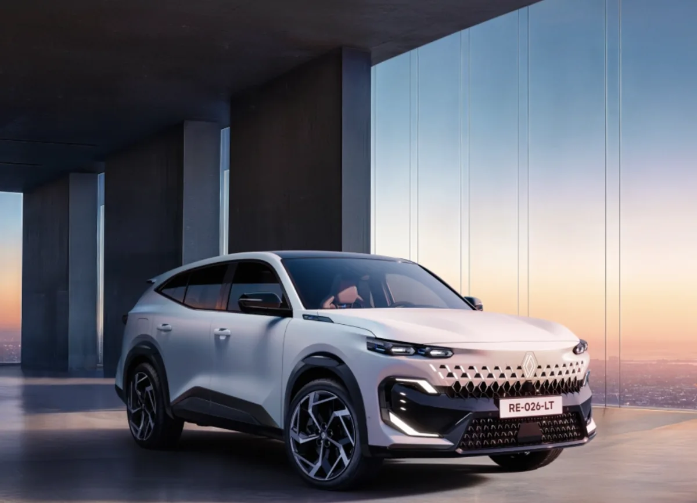
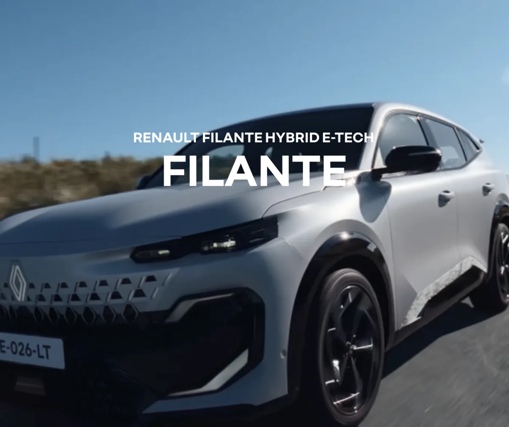

**르노 필랑트**의 가장 큰 매력 중 하나는 **250마력**의 강력한 출력과 **복합연비 15.1km/L**를 동시에 달성했다는 점입니다. 특히 도심 구간에서 **최대 75%를 전기 모드**로 주행할 수 있다는 점이 화제입니다.

1편에서 가격과 트림을 살펴봤다면, 이번 글에서는 필랑트의 심장인 **E-Tech 하이브리드 시스템**을 깊이 분석합니다. 공인연비와 실연비의 차이, 그리고 도심 전기주행이 가능한 이유까지 알아봅니다.

## E-Tech 하이브리드 시스템 구성

**[르노코리아 필랑트 E-Tech 상세 페이지](https://www.renault.co.kr/ko/model/filante_overview.jsp)**

필랑트에는 그랑 콜레오스에서 검증된 **직병렬 듀얼 모터 하이브리드 시스템**이 업그레이드되어 적용되었습니다.

**엔진**은 1.5리터 가솔린 터보 직분사 엔진으로 **150마력**과 **25.5kg.m(250Nm)**의 토크를 발휘합니다. 여기에 100kW(136마력) 구동 모터**와 **60kW 보조 모터**가 조합됩니다.

시스템 합산 **최고 출력은 250마력**입니다. 같은 급 국산 하이브리드 SUV인 싼타페 하이브리드(215마력), 쏘렌토 하이브리드(230마력)보다 높은 출력입니다. **0-100km/h 가속은 약 8.4초**로, 준대형 SUV치고 민첩한 편입니다.

**배터리**는 **1.64kWh 대용량 리튬이온 배터리**를 탑재했습니다. 일반 하이브리드 차량보다 큰 용량으로, 도심 주행 시 전기 모드 구간을 늘리는 데 기여합니다.

## 공인연비 15.1km/L의 의미

필랑트의 **공인 복합연비는 15.1km/L**입니다. 도심 14.7km/L, 고속도로 15.5km/L로 인증받았습니다. 19인치와 20인치 휠 모두 동일한 연비입니다.

경쟁 모델과 비교하면 **싼타페 하이브리드는 15.5km/L**, **쏘렌토 하이브리드는 15.3km/L**입니다. 필랑트가 0.2~0.4km/L 낮지만, 출력이 20~35마력 더 높다는 점을 고려하면 효율적인 수치입니다.

필랑트의 차체 크기는 전장 4,915mm, 전폭 1,880mm, 전고 1,635mm로 싼타페(4,830mm)보다 **85mm 더 깁니다**. 더 큰 차체에서 비슷한 연비를 내는 것은 E-Tech 시스템의 효율성을 보여줍니다.

## 도심 75% 전기주행이 가능한 이유

필랑트의 가장 독특한 특징은 **도심 구간 최대 75%를 전기 모드(EV 모드)로 주행**할 수 있다는 점입니다. 플러그인 하이브리드(PHEV)가 아닌데 어떻게 가능할까요?

비결은 **멀티모드 변속기**와 **듀얼 모터 시스템**의 조합입니다. 르노의 E-Tech 시스템은 F1 레이싱 기술에서 파생된 **도그 클러치 방식**을 사용합니다. 기존 하이브리드의 토크 컨버터 대신 직결 방식으로 동력을 전달해 손실을 최소화합니다.

**1.64kWh 배터리**는 저속 주행과 정차 시 빠르게 충전되고, 다시 출발할 때 전기 모터만으로 구동합니다. 도심의 스톱앤고 환경에서 엔진 개입을 최소화하고, 전기 모드 비율을 높이는 구조입니다.

결과적으로 신호 대기가 많은 도심에서는 엔진이 거의 작동하지 않고, 조용한 전기차처럼 주행할 수 있습니다. 연비뿐 아니라 **정숙성**에서도 큰 장점입니다.

## 실연비는 어느 정도 예상될까

공인연비 15.1km/L가 실제 주행에서도 나올까요? 그랑 콜레오스의 사례를 참고하면 예측이 가능합니다.

그랑 콜레오스 E-Tech 하이브리드의 공인연비는 **20.8km/L**이고, 실제 오너들의 평균 실연비는 **16~18km/L** 수준으로 보고됩니다. 공인연비 대비 **80~90%** 수준입니다.

필랑트에 같은 비율을 적용하면 **실연비는 12~14km/L** 정도로 예상됩니다. 도심 위주 주행 시 14km/L 내외, 고속도로 위주 시 15km/L 이상도 기대할 수 있습니다. 운전 습관에 따라 편차가 있으므로 실제 출고 후 오너 리뷰를 확인하는 것이 좋습니다.

참고로 **에코 모드**를 적극 활용하고, 급가속을 피하면 연비를 더 끌어올릴 수 있습니다. 르노 E-Tech 시스템은 회생제동 효율이 높아 내리막과 감속 구간에서 배터리를 효과적으로 충전합니다.

## 250마력인데 연비가 좋은 이유

**250마력**이라는 높은 출력에도 연비가 좋은 이유는 E-Tech 시스템의 설계 철학에 있습니다.

첫째, **엔진과 모터의 역할 분담**이 명확합니다. 저속과 출발은 전기 모터가, 고속 순항은 엔진이 담당합니다. 엔진이 가장 효율적인 영역에서만 작동하도록 제어합니다.

둘째, **터보 엔진의 다운사이징** 효과입니다. 1.5리터 작은 배기량이지만 터보와 직분사 기술로 150마력을 발휘합니다. 기본 연비 효율이 높은 엔진에 전기 모터가 더해지는 구조입니다.

셋째, **변속기 효율**입니다. 기존 CVT나 DCT 대신 도그 클러치 방식의 멀티모드 변속기를 사용해 동력 전달 손실을 줄였습니다.

## 경쟁 모델 연비 비교

4천만 원대 하이브리드 SUV의 연비를 비교하면 다음과 같습니다.

**르노 필랑트**는 복합 15.1km/L, 시스템 출력 250마력입니다. **현대 싼타페 하이브리드**는 복합 15.5km/L, 시스템 출력 215마력입니다. **기아 쏘렌토 하이브리드**는 복합 15.3km/L, 시스템 출력 230마력입니다.

연비만 보면 싼타페가 근소하게 앞서지만, 출력은 필랑트가 **20~35마력 더 높습니다**. 퍼포먼스와 연비의 균형을 어디에 두느냐에 따라 선택이 달라질 수 있습니다.

필랑트의 장점은 **도심 전기주행 비율**입니다. 출퇴근 등 도심 주행이 많은 사용자라면 체감 연비와 정숙성에서 더 만족할 가능성이 높습니다.

## 마무리

**르노 필랑트**는 250마력 출력과 복합연비 15.1km/L를 동시에 달성한 하이브리드 SUV입니다. 도심에서 최대 75%를 전기 모드로 주행할 수 있어 연비와 정숙성 모두 뛰어납니다.

다음 글에서는 필랑트의 **장단점을 솔직하게 분석**하고, 구매를 고민하는 분들을 위한 체크리스트를 정리합니다.

#르노필랑트 #필랑트연비 #E-Tech하이브리드 #250마력 #도심전기주행 #하이브리드SUV #실연비
