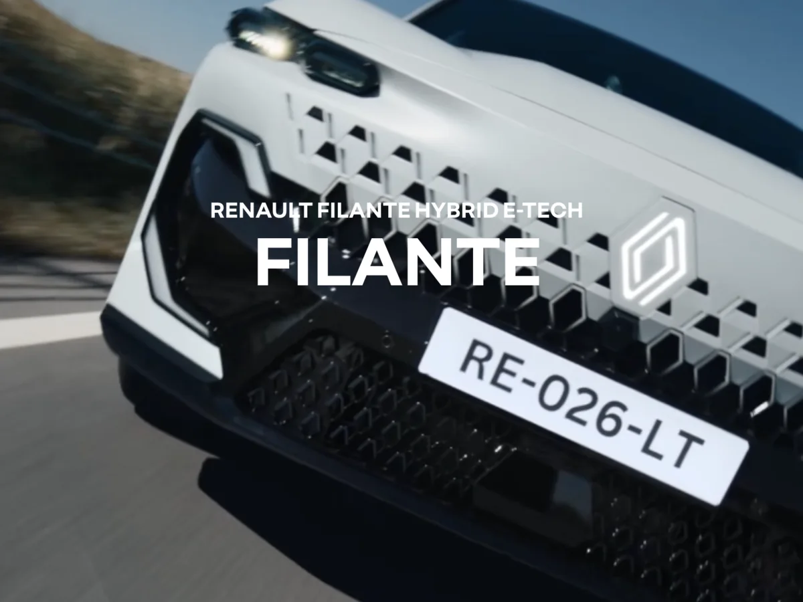
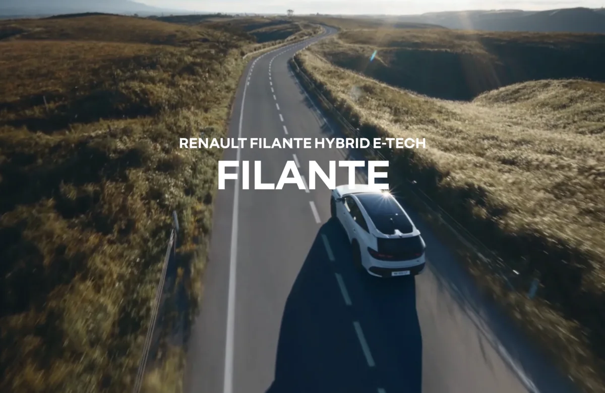
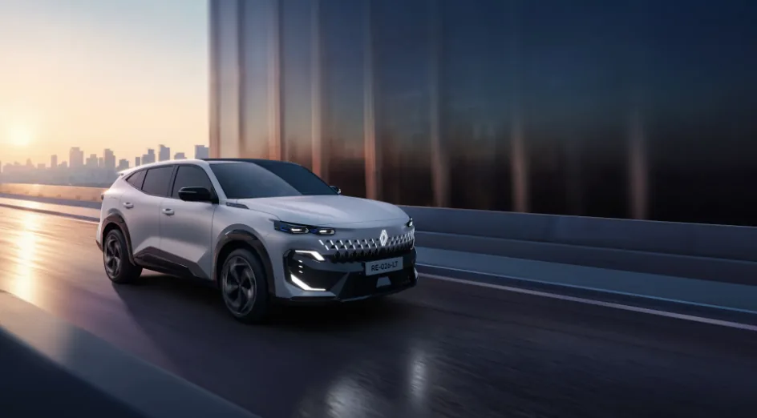

**르노 필랑트**가 공개되자마자 뜨거운 관심을 받고 있습니다. **4,331만 원**부터 시작하는 가격, **250마력** 하이브리드, 풍부한 기본 사양까지. 스펙만 보면 완벽해 보이지만, 실제로 구매해도 될까요?

1편에서 가격과 트림을, 2편에서 연비와 하이브리드 시스템을 다뤘습니다. 이번 글에서는 **필랑트의 장점과 단점을 솔직하게 분석**하고, 구매 전 꼭 확인해야 할 사항들을 정리합니다.

[필랑트 메뉴얼 바로가기](https://www.renault.co.kr/ko/model/filante_overview.jsp)

## 장점 1 가격 대비 풍부한 기본 사양

필랑트의 가장 큰 장점은 **가성비**입니다. 기본 트림인 테크노(4,331만 원)부터 **34개 ADAS**, **AI 음성인식**, **파노라마 스크린**, **전동 테일게이트**가 기본 탑재됩니다.

같은 가격대 국산 하이브리드 SUV의 기본 트림과 비교하면 사양 차이가 확연합니다. 싼타페 하이브리드 캘리그래피(최상위)가 4,765만 원인데, 필랑트 테크노가 더 저렴하면서 AI 음성인식, 트리플 스크린 등 일부 사양은 더 앞섭니다.

르노코리아가 "깡통도 풀옵션"이라는 평가를 받는 이유입니다. 기본 사양만으로 충분히 만족스럽게 탈 수 있습니다.

## 장점 2 250마력 강력한 출력

**시스템 최고 출력 250마력**은 동급 최강 수준입니다. 싼타페 하이브리드 215마력, 쏘렌토 하이브리드 230마력보다 높습니다.

0-100km/h 가속 약 8.4초로, 준대형 SUV치고 민첩합니다. 고속도로 진입이나 추월 시 답답함 없이 시원하게 가속됩니다. 가족 단위로 탑승해도 출력 부족을 느끼기 어렵습니다.

특히 산악 도로나 오르막에서 전기 모터의 즉각적인 토크가 도움됩니다. 하이브리드 특유의 부드러운 가속감과 충분한 힘을 동시에 경험할 수 있습니다.

## 장점 3 도심 전기주행으로 정숙성 확보

도심에서 **최대 75%를 전기 모드**로 주행할 수 있어 정숙성이 뛰어납니다. 신호 대기 후 출발, 저속 주행, 주차장 이동 시 엔진 소음 없이 전기차처럼 조용합니다.

르노 E-Tech 시스템은 엔진 개입 시에도 진동과 소음이 적다는 평가를 받습니다. 기존 그랑 콜레오스 오너들이 "엔진이 언제 켜지는지 모르겠다"고 할 정도로 부드럽습니다.

## 장점 4 세단과 SUV의 장점 결합

필랑트는 **쿠페형 크로스오버** 디자인으로 세단의 우아함과 SUV의 실용성을 결합했습니다. 전고 1,635mm로 일반 SUV(1,700mm 이상)보다 낮아 주행 안정성이 좋습니다.

**주파수 감응형 댐퍼(SFD)**가 적용되어 노면 상황에 따라 댐퍼 강도를 자동 조절합니다. 고속 주행 시 안정감과 저속 주행 시 부드러운 승차감을 모두 잡았습니다.

## 단점 1 트렁크 공간 경쟁 모델 대비 협소

필랑트의 트렁크 용량은 **540L**(2열 사용 시)입니다. 싼타페 725L, 쏘렌토 705L와 비교하면 **150L 이상 작습니다**.

쿠페형 루프라인 때문에 적재 높이도 제한적입니다. 캠핑 장비나 대형 짐을 자주 싣는 분들에게는 아쉬운 부분입니다. 2열을 접으면 공간이 넓어지지만, 일상적인 적재 공간은 경쟁 모델보다 좁습니다.

## 단점 2 2열 공간 성인 3명은 빡빡

필랑트의 휠베이스는 2,775mm로 싼타페(2,815mm), 쏘렌토(2,815mm)보다 **40mm 짧습니다**. 2열 레그룸은 충분하지만, 성인 3명이 나란히 앉으면 어깨가 닿을 수 있습니다.

가족 4인까지는 넉넉하지만, 5인 만석 시 장거리 이동은 다소 불편할 수 있습니다. 2열 슬라이딩과 리클라이닝으로 조절 가능하나, 절대적인 공간은 일반 SUV보다 좁습니다.

## 단점 3 르노 브랜드 인지도와 잔존가치

솔직히 말해 르노코리아의 **브랜드 인지도**는 현대기아 대비 낮습니다. 이는 중고차 시장에서의 **잔존가치(리세일 밸류)**에 영향을 줄 수 있습니다.

그러나 그랑 콜레오스의 성공으로 르노 이미지가 개선되고 있고, 필랑트도 수출 모델로 글로벌 판매 예정이라 품질과 내구성에 대한 검증이 진행될 것입니다. 장기 보유 계획이라면 잔존가치보다 실사용 만족도에 집중하는 것도 방법입니다.

## 단점 4 서비스 네트워크

르노코리아의 **서비스센터 수**는 현대기아보다 적습니다. 지역에 따라 정비소 접근성이 떨어질 수 있습니다.

다만 르노코리아는 무상 픽업 서비스, 대차 서비스 등을 제공하며 서비스 품질 개선에 노력 중입니다. 구매 전 거주지 근처 서비스센터 위치를 확인하고, 정비 편의성을 점검하는 것이 좋습니다.

## 단점 5 테크노 트림 출고 지연

기본 트림인 **테크노의 출고 시기는 3분기**입니다. 당장 차가 필요한 분들은 아이코닉 이상 트림을 선택하거나 기다려야 합니다.

아이코닉과 에스프리 알핀은 **3월 출고** 예정으로, 빠른 인도를 원하면 상위 트림을 선택해야 합니다. 이 점이 테크노 트림을 노리는 분들에게 아쉬운 부분입니다.

## 구매 전 체크리스트

**시승은 필수입니다.** E-Tech 하이브리드의 주행 특성, 엔진-모터 전환 시 느낌, 가속감을 직접 경험해보세요. 2열에도 앉아서 공간감을 확인하는 것이 좋습니다.

**트렁크 공간을 확인하세요.** 유모차, 골프백, 캠핑 장비 등 자주 싣는 짐이 들어가는지 실물로 체크해보세요. 사진보다 직접 보면 감이 옵니다.

**서비스센터 위치를 확인하세요.** 거주지에서 가까운 르노 서비스센터가 있는지, 정기점검 예약이 수월한지 미리 알아보세요.

**출고 시기를 확인하세요.** 원하는 트림의 출고 예상 시기를 딜러에게 정확히 문의하고, 일정에 맞는지 확인하세요.

**경쟁 모델과 비교 시승하세요.** 싼타페, 쏘렌토와 직접 비교해보면 자신에게 맞는 차가 명확해집니다. 출력, 공간, 승차감, 디자인 등 우선순위를 정해두면 선택이 쉬워집니다.

## 이런 분들에게 추천합니다

**도심 출퇴근이 많은 분**에게 추천합니다. 75% 전기주행으로 연비와 정숙성 모두 만족할 수 있습니다.

**디자인을 중시하는 분**에게 추천합니다. 쿠페형 크로스오버의 세련된 라인은 국산 SUV와 확실히 다른 매력이 있습니다.

**가성비를 중시하는 분**에게 추천합니다. 기본 트림부터 풍부한 사양으로 굳이 상위 트림을 고를 필요가 적습니다.

**강력한 출력을 원하는 분**에게 추천합니다. 250마력은 동급 최강으로, 고속 주행과 추월에서 여유롭습니다.

## 이런 분들은 다시 고려하세요

**적재 공간이 중요한 분**은 싼타페나 쏘렌토가 더 적합합니다. 트렁크 150L 차이는 실사용에서 체감됩니다.

**5인 만석 장거리 이동이 잦은 분**은 2열 공간을 직접 확인 후 결정하세요. 성인 3명 탑승 시 어깨 공간이 빡빡할 수 있습니다.

**당장 차가 필요한데 테크노를 원하는 분**은 출고 시기(3분기)를 감안해야 합니다. 급하면 아이코닉을 선택하거나 다른 차종을 고려하세요.

## 마무리

**르노 필랑트**는 4천만 원대에서 250마력, 15.1km/L 연비, 풍부한 기본 사양을 갖춘 매력적인 하이브리드 SUV입니다. 도심 전기주행, 세련된 디자인, 강력한 출력이 장점이지만, 트렁크 공간과 2열 여유, 브랜드 인지도는 고려해야 할 부분입니다.

이 연작 시리즈를 통해 가격, 연비, 장단점을 모두 살펴봤습니다. 시승과 경쟁 모델 비교를 통해 자신에게 맞는 선택을 하시길 바랍니다.

#르노필랑트 #필랑트장단점 #필랑트구매 #하이브리드SUV #250마력 #필랑트단점 #2026신차
